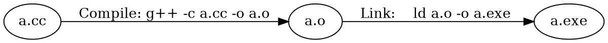
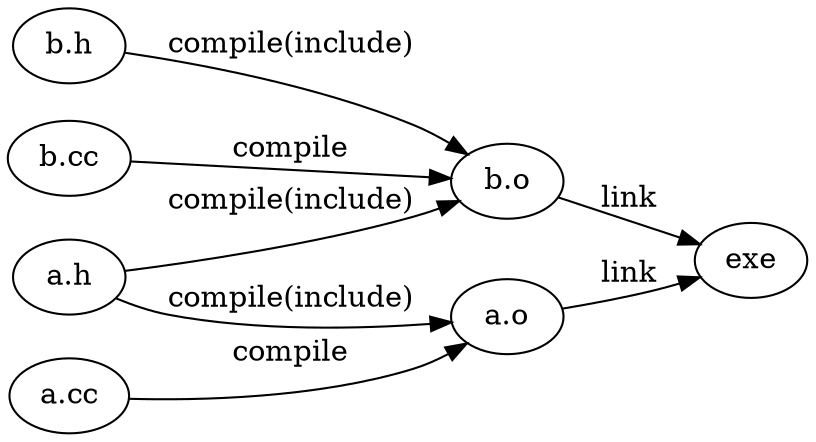
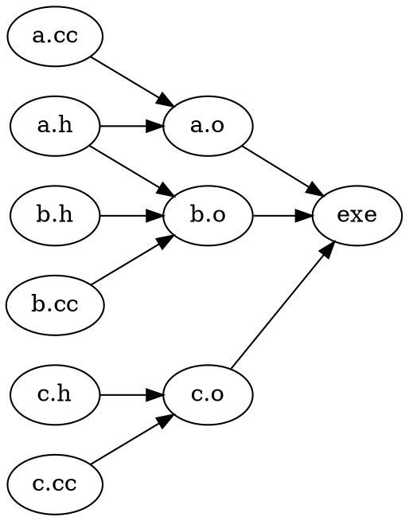

% Make
% Deepak Ravi
% 

Overview 
---------------

- Make
    - Lab: Write a simple makefile

Overview
--------
- Make
    - Working of make
    - Problems when writing a Makefile
- Linux Kernel build
    - Modify the configuration options
    - Add a new configuration option for your new driver
    - Build your own driver and load/unload it

Compilation
-------------------

Compilation (contd)
-------------------

Compilation (contd)
-------------------

Compilation (contd)
-------------------

- Issue?

Compilation (contd)
-------------------

- Issue? Hint: What if I change only b.h?

Compilation (contd)
-------------------

- Sol: We need a tool which takes dependency graph, and implements topological sort.

Make
-----

- Takes dependency graph and commands to be executed in each edge
- Takes a target
- Then solve.

Make
----

     target : dependency
         shell command to execute 
  
     a.o : a.cc
         g++ -c a.cc -o a.o

- Note: Shell commands needs to begin with a tab

Make
----

    exe : a.o b.o c.o
    	g++ a.o b.o c.o -o exe
    
    a.o : a.cc a.h
    	g++ -c a.cc -o a.o
    b.o : b.cc b.h a.h
    	g++ -c b.cc -o b.o
    c.o : c.cc c.h
    	g++ -c c.cc -o c.o
    

Make
----

    exe : a.o b.o c.o
    	g++ a.o b.o c.o -o exe
    
    a.o : a.cc a.h
    	g++ -c a.cc -o a.o
    b.o : b.cc b.h a.h
    	g++ -c b.cc -o b.o
    c.o : c.cc c.h
    	g++ -c c.cc -o c.o
    

- Issue?

Make
----

    exe : a.o b.o c.o
    	g++ a.o b.o c.o -o exe
    
    a.o : a.cc a.h
    	g++ -c a.cc -o a.o
    b.o : b.cc b.h a.h
    	g++ -c b.cc -o b.o
    c.o : c.cc c.h
    	g++ -c c.cc -o c.o
    

- Issue?
    - What if we wanted to add -O3 to compilation?
    - What if I want to change g++ to g++-5
- Solution?

Make
----
    CXX=g++
    CXXFLAGS=
    LD=g++

    exe : a.o b.o c.o
    	$(LD) a.o b.o c.o -o exe
    
    a.o : a.cc a.h
    	$(CXX) $(CXXFLAGS) -c a.cc -o a.o
    b.o : b.cc b.h a.h
    	$(CXX) $(CXXFLAGS) -c b.cc -o b.o
    c.o : c.cc c.h
    	$(CXX) $(CXXFLAGS) -c c.cc -o c.o
    
- Issue?

Make
----
    CXX=g++
    CXXFLAGS=
    LD=g++

    objects = a.o b.o c.o

    exe : $(objects)
    	$(LD) $(objects) -o exe
    
    a.o : a.cc a.h
    	$(CXX) $(CXXFLAGS) -c a.cc -o a.o
    b.o : b.cc b.h a.h
    	$(CXX) $(CXXFLAGS) -c b.cc -o b.o
    c.o : c.cc c.h
    	$(CXX) $(CXXFLAGS) -c c.cc -o c.o
    
- Issue? Too many repetitions of same pattern!
- Solution?

Make
----
    CXX=g++
    CXXFLAGS=
    LD=g++

    objects = a.o b.o c.o

    exe : $(objects)
    	$(LD) $(objects) -o exe

    %.o : %.cc
    	$(CXX) $(CXXFLAGS) -c $*.cc -o $*.o

    a.o : a.h
    b.o : b.h a.h
    c.o : c.h 
    
- Issue? automatic header file dependency generation
    - Use: g++ -MMD 

Make
----
    CXX=g++
    CXXFLAGS=
    LD=g++

    objects = a.o b.o c.o

    exe : $(objects)
    	$(LD) $(objects) -o exe

    %.o : %.cc
    	$(CXX) $(CXXFLAGS) -c $*.cc -o $*.o

    
- Issue? 
- What if we want to include c.o only if CONFIG_C_ENABLE=y ?

Make
----

Hint:

    objects-y =  a.o b.o
    objects-y += c.o

    objects=objects-y

Make
----

    CONFIG_C_ENABLE=y

    objects-y =  a.o b.o
    objects-$(CONFIG_C_ENABLE) += c.o

    objects=objects-y

Make
----

    include config

    objects-y =  a.o b.o
    objects-$(CONFIG_C_ENABLE) += c.o

    objects=objects-y

- Issue? What if someone changed config?

Make
----

     include config
                                                                                 
     objects-y = a.o b.o
     objects-$(CONFIG_C_ENABLE) += c.o 
     objects = $(objects-y)
                                                                                 
     exe : config $(objects)
     	$(LD) $(objects) -o exe
                                                                                 
     %.o : %.cc  config
     	$(CXX) $(CXXFLAGS) -c $*.cc -o $*.o 
 

- Issue: User need to manually edit the file _config_

