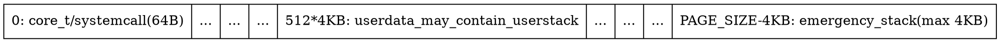
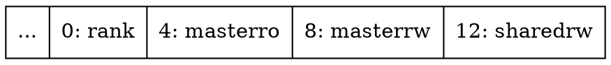
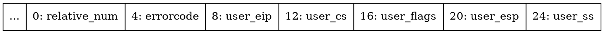
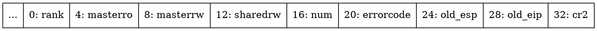
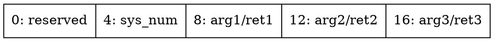
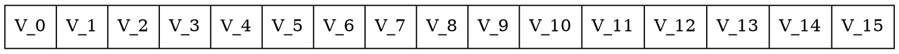
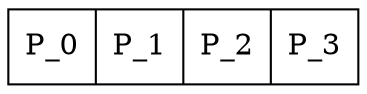
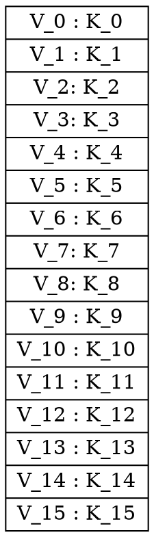
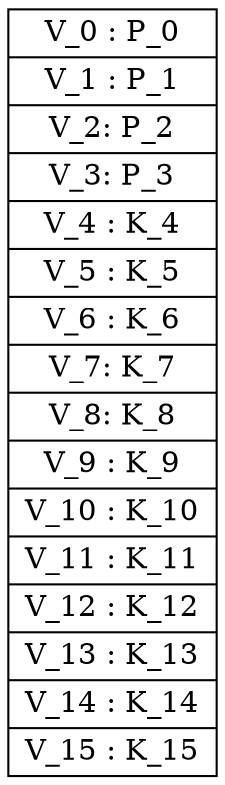
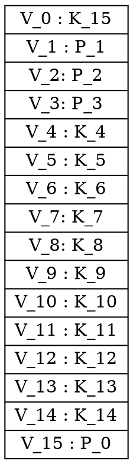

---
title:  'HoH: COL331/COL633 Labs'
pagetitle:  'HoH: COL331/COL633 Labs'
author:  []
date: Jan 1, 2017
tags: [hoh, operating system]
subtitle: _What's the best way for learning OS? Create one!_
header-includes: |
    <link rel="stylesheet" href="index.less" type="text/less" media="screen" />
    <script src="../js/less.min.js" type="text/javascript"></script>
...


Also available in [pdf](index.pdf), [slides](index.slides.html). [beamer](index.beamer.pdf). [latex](index.tex).

Introduction {.unnumbered}
-------------------------

#### Introduction {.unnumbered}
Hello! I'm your lab-instructor for this course.

In this series, you will join forces with me, and together, we will build a *kernel from the scratch*.
We both will be working on this kernel.

I'll do some coding in a branch, and ask you to implement some functionality.
You can get my code by merging the branch with yours, and implement the functionality I asked.
Once you implement it and commit the changes in your repository,
I'll again work on the kernel on some other branch..

#### Status so far - our kernel boots into C code {.unnumbered}
So far, I have managed to write: [See osdev barebones](http://wiki.osdev.org/Bare_bones)

1. x86/boot.S : containing seven lines of 32-bit x86 assembly instructions to:
     - set the stack pointer,
```asm
       movl  $tmpstack_bottom, %esp
```
     - clear flags,
```asm
       pushl $0
       popf
```
     - call the C function
```asm
       call  core_boot
```
     - enter infinite loop
```asm
       cli
     loop:
       hlt
       jmp   loop
```

2. x86/main.cc : a C function which does nothing
```c
     extern "C" void core_boot(){
     }
```


#### make {.unnumbered}

- Syntax:
```bash
bash$ make <target> B=<release/debug>
where target =
      iso      : create boot cd
      exe      : build kernel (default)
      qemu     : run qemu
      qemu-gdb : qemu with gdb
```

- Usage: make iso / make qemu / make qemu-gdb B=debug
- Try 'make qemu-direct' and 'make qemu-gdb-direct B=debug' if you face any issues.


#### On Boot {.unnumbered}

- CPU sets cs:ip to 0xffff:0x0000 and starts executing code from this location(BIOS ROM is memory mapped at this location. When CPU tries to load the instruction from this location, cache and memory will be bypassed, and instructions will be directly loaded from ROM).
- *CPU starts executing BIOS code directly from ROM.*
- BIOS code initializes cache, RAM and other peripherals
- BIOS code installs its handlers by modifying Interrupt descriptor table(IDT) to provide services for bootloader
- BIOS loads the boot loader(grub2) code from the boot disk at 0x0000:0x7c00 and jump to it. Now, *CPU starts executing boot loader code(grub2)*.
- (specific to grub2): grub2 uses bios provided interrupt handlers to load it's configuration file /boot/grub/grub2.cfg and gets the path of kernel to be loaded, and the kernel is multiboot standard compatible - and grub2 switches the CPU to 32 bit mode.
- Bootloader(grub2) loads initial part of kernel containing ELF header from the disk (using BIOS provided interrupt handlers) into RAM
- grub2 scans kernel's initial part for 'multiboot header' to know the interface expected from the kernel - for ex: multiboot version.
- Bootloader reads the ELF header and loads each section of kernel from disk into corresponding address in RAM(as mentioned in ELF header)
- Bootloader jumps to the starting address mentioned in kernel's ELF header(usually _start)
- *CPU starts executing kernel code*(_start).

#### Analyzing tracefile {.unnumbered}

I've enabled qemu's instruction tracing.
So after executing 'make qemu', a trace file created named qemu.log in the current working directory.

When looking at the tracefile(qemu.log), please skip the initial bios instructions
```qemutrace
     ----------------
     IN:
     0xfffffff0:  ljmp   $0xf000,$0xe05b
```


and also skip the bootloader code,
```qemutrace
     ----------------
     IN:
     0x00007c00:  call   0x7c03
```

#### Our kernel's instruction trace {.unnumbered}

Towards the end you can see our kernel's instruction trace. For example:
```qemutrace
     ----------------
     IN:
     0x00100050:  mov    $0x104080,%esp
     0x00100055:  push   $0x0
     0x00100057:  popf
     0x00100058:  call   0x1040a0
     ----------------
     IN: core_boot
     0x001040a0:  repz ret
     0x0010005d:  cli
     0x0010005e:  hlt
```

#### Boot our kernel from your laptop {.unnumbered}

Optional: [Multiboot specification](http://www.gnu.org/software/grub/manual/multiboot/multiboot.pdf) specifies the interface between boot loader(eg: grub) and the kernel.
You can also boot our kernel from your laptop, by using any multiboot combatible boot loader.

For example: On grub2, I press 'c' to enter command prompt, and type:
```grub2
     (grub2) multiboot (hd0,msdos5)/home/alice/hohlabs/_tmp/hoh.exe
     (grub2) boot
```


Setup {.unnumbered}
-------------------------

So here's what you should do:

#### Tools {.unnumbered}

Please ensure you have latest version of:

- qemu           (package: qemu qemu-system)
- g++            (package: g++-multilib >=4.7)
- git            (package: git-all)
- grub2          (package: grub2 grub-pc-bin)
- boost library  (package: libboost-all-dev)
- xorriso (to create iso image. Otherwise you'll get a warning that )
- coreutils(for makefile)

In debian/ubuntu, do:
```bash
   bash$ sudo apt-get install qemu qemu-system g++-multilib git-all grub2 grub-pc-bin libboost-all-dev xorriso
```

#### Clone the repository {.unnumbered}

Since we both will work on this kernel, we need to have a version control system. We'll use git as our version control system. Please clone the repository to your local directory
```bash
     user@host:~$ git clone ssh://<user>@palasi.cse.iitd.ac.in/misc/research/teaching/sbansal/os/hohlabs.git
     user@host:~$ cd hohlabs
     user@host:~/hohlabs$
```

#### Procedure {.unnumbered}
For each parts, do

1. Please get the changes done by lab-instructor by merging the corresponding branch to your master branch
```bash
     user@host:~/hohlabs$ git pull
     user@host:~/hohlabs$ git merge origin/<branch_name>
```
    For example, to get first part, do:
```bash
     user@host:~/hohlabs$ git pull
     user@host:~/hohlabs$ git merge origin/vgatext
```

2. *Modify the files under the directory "labs" only * to add the missing functionality.
   For example, for the first part, you should modify the function writechar in labs/vgatext.h
```bash
     user@host:~/hohlabs$ git pull
     user@host:~/hohlabs$ vim labs/vgatext.h
```
    Test your code by:
```bash
     user@host:~/hohlabs$ make qemu
```
    (Optional) To debug:

     - From first terminal:
```bash
        user@host:~/hohlabs$ make qemu B=debug
```

     - From another terminal:
```bash
       user@host:~/hohlabs$ gdb
```

    In gdb, you can set break point for example '_start'
```gdb
       (gdb) break _start
       (gdb) ni
       (gdb) continue
```


3. Commit your changes in your local repository
```bash
       user@host:~/hohlabs$ git add -p labs/
       user@host:~/hohlabs$ git commit -m "your log message"

       #Advanced: git add labs/ ; git commit -m "commit message" ; git stash ; ....  now do pull/merge .... ; git stash pop;
```

4. Do submit your code so far. (resubmissions are allowed)

#### Submission {.unnumbered}
- To submit the assignment, from palasi:
    - make sure your changes are available in palasi. Skip this step, if you're working in GCL.
```bash
       user@host:~/os$ scp -r hohlabs user@palasi.cse.iitd.ac.in:os
       user@host:~/os$ ssh user@palasi.cse.iitd.ac.in
       user@palasi:~$ cd os/hohlabs
       user@palasi:~/os/hohlabs$ os-submit-lab <labid>
```
    - If you are working in GCL, just submit your changes in palasi using:
```bash
       user@palasi:~/hohlabs$ os-submit-lab <labid>
```
- Can be submitted from palasi only.
- For teams of more than one members, only one member needs to submit; the submission script allows you to name the team members.
- Resubmissions are allowed.
- For late penalty calculations, we only consider your submission using os-submit-lab ( It is possible to change git commit history and filesystem modification time)
- Make sure you check your submission is correct by using: <code>os-get-submission</code>


* * *

Shell
======================================

#### Overview {.unnumbered}

In this first part, we'll look into basic primitives required for writing an
OS.


- Evaluation:
    - Code component:
         - *NOTHING : 0  *   Not working
         - *PARTIAL : 1  *   Partial/buggy - TA is able to find at least one bug in your code
         - *TYPO    : 1.5*   Code is not clean
         - *CORRECT : 2  *   Working code
    - Viva component:
         - *FLAGGED          : 0 * Can not explain his/her own code
         - *JUST_IMPLEMENTED : 1 * can explain his/her own code but can't explain lab-instructor's code
         - *KNOWS_WHY        : 2 * can explain his/her own code + lab-instructor's code

    - Marks for each part is computed by following equation:
           $$ Marks = (W_d * D + W_v * V) $$


    - For 1.1-1.3: $W_d = 0.25$ and  $W_v = 0.25$
    - For 1.4-1.7: $W_d = 0.40$ and $W_v = 0.10$
    - For 1.8: $W_d = 1.20$ and $W_v = 0.30$
    - For 1.9: $W_d = 0.80$ and $W_v = 0.20$
    - For 1.10: $W_d = 1.20$ and $W_v = 0.30$
    - For 1.10-1.13: $W_d = 0.80$ and $W_v = 0.20$
    - For 1.14: $W_d = 2.00$ and $W_v = 0.50$


    - During Viva: If you're not able to explain why you wrote the code,  we'll award you zero for both code component and viva component of that part.
          - Note: Following explanation won't be accepted:
              - You tried hit and trial and somehow it worked.
              - You forgot the code
    - During viva: If you're not able to explain the code that you wrote yourself(what is the code doing) we will report you as a major copy case and demo won't be taken for any of the parts.

 MMIO
-------------------------------------------------------------------------

####MergeRequest {.unnumbered}

I've added few more code in origin/vgatext branch. Please merge it with your master branch
```bash
        user@host:~/hohlabs$ git pull
        user@host:~/hohlabs$ git merge origin/vgatext
```

####Aim {.unnumbered}

In this part, we'll program a memory mapped device while enhancing our kernel by adding the functionality to display "Hello, world!".

####Information{.unnumbered}

In VGA text mode, 16 bit (2 bytes) of information is stored for each screen character and is stored in row-major order. First byte(MSB) is the ASCII code of the screen character and the next byte(LSB) encodes background(4 bit: msb) and foreground color(4 bit: lsb). Color: 0x0 corresponds to black pallete, 0x7 corresponds to white pallete, 0x1 corresponds to blue pallete.


####Usage{.unnumbered}

I've added few lines of C code in x86/main.cc:
```c
       for(i=0;i<sizeof mesg;i++){
         vgatext::writechar(i, mesg[i], bg_color, fg_color, vgatext_base_address);
       }
```


####Define{.unnumbered}

You need to define the following functions in labs/vgatext.h
```c
        void writechar(int loc, uint8_t c, uint8_t bg, uint8_t fg, addr_t base);
```


Arguments of vgatext::writechar:

- loc: location of screen character to be written,
- c: ascii code of the character to be written(8 bit)
- bg: background color(4 bit)
- fg: foreground color(4 bit)
- base: the memory mapped address of the vga text buffer


####Given{.unnumbered}

To help you with mmio, I also added util/io.h which has following functions:
```c
       mmio::read8(base,byte_offset)
       mmio::write8(base,byte_offset,8 bit value)
       mmio::read16(base,byte_offset)
       mmio::write16(base,byte_offset,16 bit value)
       mmio::read32(base,byte_offset)
       mmio::write32(base,byte_offset,32 bit value)
```


####Tip{.unnumbered}

- You might find mmio::write16/mmio::write8 useful for implementing vgatext::writechar.
- Note that both mmio::write8 and mmio::write16 takes byte offset as an argument.
- If you're using mmio::write16, please take care of endianness - x86 is little endian.
- When using bit shift operations, we recommend you to use unsigned integer types

####Turn in{.unnumbered}

You're required to implement vgatext::writechar() in labs/vgatext.h

####Check{.unnumbered}

The kernel shall print 'Hello, world!' in the top left corner of the screen.

####Note{.unnumbered}

- Expected: 1-2 line of C++ code.  If you find yourself adding more than 10 lines of code in this part, please raise an alarm.  After 10 logical lines of code, each logical line of code you add, 10% of mark will be substracted.
- Optional: Boot our kernel from a PC/laptop instead of qemu.

####Note{.unnumbered}

- Endianness is a property of CPU -  it's about what should be the memory contents "when a CPU executes Write instruction to memory" or what is the value of register if we execute read instruction from memory.

    When we say: MSB: char(8 bits) and LSB: bgfg (8 bits) - it's independent of endianness.

    It means: first byte should be char. and next byte is bgfg.

    It specifies what should be the memory contents after you execute the CPU instruction. And depending on the target CPU's (in which your OS is written for) endianness, you need to figure out what value you should write.

####Demo Tip{.unnumbered}

Be prepared to answer following viva questions:

- How to program with memory mapped devices?
- What happens between 'programming from cpu' to 'device recieving the command/data' (Refer: Computer Architecture course)
- How to boot your kernel into C/C++ code?

 PMIO
-------------------------------------------------------------------------

####MergeRequest{.unnumbered}

Now it's my turn. I've added few more code in origin/serial branch. Please merge it with your master branch
```bash
    user@host:~/hohlabs$ git pull
    user@host:~/hohlabs$ git merge origin/serial
```


####Aim{.unnumbered}

In this part, we'll program an I/O mapped device while enhancing our kernel by adding debugging routines which will print debug messages to serial port.

####Information{.unnumbered}

Serial port aka pc16550d uart(universal asynchronous receiver transmitter).
In pc16550d uart,

Registers:

- the "transmitter holding" register of size 8 bits(1 byte) is I/O mapped at zeroth offset, and
- the "line status" register of size 8 bits(1 byte) is I/O mapped at fifth offset.

The line status register has several fields (in lsb order):
```mackerel
    name="dr",           size="1 bit", description="Data ready"
    name="oe",           size="1 bit", description="Overrun error"
    name="pe",           size="1 bit", description="Parity error"
    name="fe",           size="1 bit", description="Framing error"
    name="bi",           size="1 bit", description="Break interrupt"
    name="thre",         size="1 bit", description="Transmitter holding register"
    name="temt",         size="1 bit", description="Transmitter empty"
    name="erfifo",       size="1 bit", description="Error in RCVR FIFO"
```


Before one writes a character(data) to transmitter holding register, one need to ensure that "thre" bit ([5:5] from lsb: fifth bit indexed from zero) in the line status register is set.

####Usage{.unnumbered}

I've added hoh_debug macro in util/debug.h, which will convert the arguments into string and call serial::print for each character in the string. Usage:

In x86/main.cc: I've added the following line.
```c
    hoh_debug("Hello, serial!");
```

hoh_debug macro will expand to a call to serial::print()

I also added serial::print function in util/debug.cc:
```c
    void serial::print(char c){
       wait until serial::is_transmitter_ready(serial_portbase) is true
       call serial::writechar(c,serial_portbase)
    }
```

So, once you implement the required two functions, you'll be able to see "Hello, serial!" in your terminal.


####Define{.unnumbered}

You need to define the following functions in labs/serial.h
```c
    bool is_transmitter_ready(io_t baseport);
    void writechar(uint8_t c, io_t baseport);
```

####Given{.unnumbered}

To help you with I/O(in and out asm), I had added following functions in util/io.h:
```c
    io::write8(baseport, offset, 8 bit value)
    io::write16(baseport, offset, 16 bit value)
    io::read8(baseport,offset)
    io::read16(baseport,offset)
```

####Tip{.unnumbered}

- You may find: io::read8(baseport,offset) and io::write8(baseport, offset, value) defined in util/io.h useful.
- When using bit shift operations, we recommend you to use unsigned integer types

####Turn in{.unnumbered}

You're required to implement serial::is_transmitter_ready() and serial::writechar() in labs/serial.h

####Check{.unnumbered}

The kernel shall print 'Hello, serial!' in your terminal.

####Note{.unnumbered}

- Expected: 2-4 line of C++ code. If you find yourself adding more than 20 lines of code in this part, please raise an alarm.  After 20 logical lines of code, each logical line of code you add, 5% of mark will be substracted.


####Demo Tip{.unnumbered}

Be prepared to answer following viva questions:

- How to program with io mapped devices?
- What happens between 'programming from cpu' to 'device recieving the command/data' (Refer: Computer Architecture course)


Abstract mmio/pmio
-------------------------------------------------

#### MergeRequest {.unnumbered}

I've added few more code in origin/keyboard branch. Please merge it with your master branch
```bash
    user@host:~/hohlabs$ git pull
    user@host:~/hohlabs$ git merge origin/keyboard
```

#### Aim {.unnumbered}

In this part, we'll look at one way of abstracting out details of mmio::read8 vs io::read8 while enhance our kernel by adding a simple keyboard driver.

#### Information {.unnumbered}

In Keyboard(8042, name=lpc_kbd), there are two main registers

- status register: size="8 bits"
     The status register has several fields
```mackerel
        name="perr",     size="1 bit", description="Parity error"
        name="timeout",  size="1 bit", description="General timeout"
        name="aobf",     size="1 bit", description="Auxiliary device output buffer full"
        name="is",       size="1 bit", description="Inhibit switch"
        name="cd",       size="1 bit", description="Command/data"
        name="sf",       size="1 bit", description="System flag"
        name="ibf",      size="1 bit", description="Input buffer full"
        name="obf",      size="1 bit", description="Output buffer full"
```
- input register: size="8 bits"

Before reading "input" register value, we need to make sure that the input buffer(of size 1) has data.
Data availability in input buffer is indicated by the "Output Buffer full" bit in "status" register(Keyboard's output buffer to CPU).
So, we need to make sure that "Output Buffer full" bit is set in the "status" register.


To read value of register, use:
```c
    regiser_value = <devicename>_<registername>_rd(address of device info structure);
```

To extract value of a field from register value, use:
```c
    field_value = <devicename>_<registername>_<fieldname>_extract(register_value);
```

For example, generated/lpc_kbd.h contains following functions:


####Usage {.unnumbered}

```c
    core_loop_step():
        if(!has_key(dev)){
          return;
        }
        input=get_key(dev);
        hoh_debug("Got key: "<<input);

    core_loop():
        repeat core_loop_step
```

#### Define {.unnumbered}

You need to define the following functions in labs/keyboard.h
```c
    bool has_key(lpc_kbd_t& dev);
    uint8_t get_key(lpc_kbd_t& dev);
```

#### Given {.unnumbered}

Following functions are defined in generated/lpc_kbd.h(generated from spec/lpc_kbd.spec using modified mackerel):
```c
    lpc_kbd_status_rd()           : return the value of "status" register  of "lpc_kbd" device
    lpc_kbd_status_obf_extract()  : extract "obf" field from "status" register   of "lpc_kbd" device
    lpc_kbd_input_rd()            : return the value of "input" register of "lpc_kbd" device
```

#### Tip {.unnumbered}

Trivial.

#### Turn in {.unnumbered}

You're required to implement the required functions in labs/keyboard.h

####Check {.unnumbered}

Kernel shall print scancode of each key pressed in your terminal(hoh_debug).

####Note {.unnumbered}

- Expected: 2-4 line of C++ code. If you find yourself adding more than 10 lines of code in this part, please raise an alarm.  After 10 logical lines of code, each logical line of code you add, 10% of mark will be substracted.

####Demo Tip {.unnumbered}

Be prepared to answer following viva questions:

- Is keyboard memory mapped(mmio::read8) or io mapped(io::read8)?
- What's the offset of status register and input register from basemem/baseport?
- Which bits corresponds to obf field in status regiser? How to extract those bitfields from value of status register?
- Endianness?
- Is knowing answer to above questions necessary while using the given functions?


####Credits {.unnumbered}

Device interface functions in generated/lpc_kbd.h are generated by a modified version of mackerel.

kShell
--------------------------------

####MergeRequest {.unnumbered}

I've added few more code in origin/shell branch. Please merge it with your master branch
```bash
    user@host:~/hohlabs$ git pull
    user@host:~/hohlabs$ git merge origin/shell
```


####Aim {.unnumbered}

In this part, we'll look at one design approach while implementing a toy shell supporting builtin functions only.

- You need to implement the shell by implementing the given interfaces(in labs/shell.h and labs/shell.cc).
- You are *not* allowed to modify the interface and it's usage in x86/main.cc.
- You are *not* allowed to use any global variables or static variables in your functions.
- To make sure we have a personalized UI for each student, exact user interface is open - So be creative!
     - While rendering, you may:
        - use menu based interface: with or without buttons, use: up/down arrows, or:
           (each builtin command could be a menu item).
        - command based interface:
        - a combination of above or invent a new one.
     - While handling keyboard event, you may:
        - use up/down/left/right arrows, enter and esc keys to navigate, or:
        - directly assign shortcuts to each menu, or
        - a combination of above or invent a new one.
- Exact builtin commands/functionality that you need to support is open - Be creative! You may support multiple builtin commands, like:
     - computation tasks: factorial, fibnocci etc
     - string commands like simple echo.
- You're required to provide at least two functionalities:
     - A status bar showing number of key presses so far. Whenever user pressed a key, number should be updated on the screen.
     - one long computation task which will take at least few seconds to compute.


####Information {.unnumbered}

Reuses previous parts of this series to create a shell.

####Usage {.unnumbered}

```c
   core_loop_step():
       if user has pressed key, get the key and do:
           shell_update(ro: key, rw: shell_state);

       // execute shell for one time slot to do some computation, if required.
       shell_step(rw: shell_state);

       // shellstate -> renderstate: compute render state from shell state
       shell_render(ro: shell_state, wo: render_state);

       if not render_eq(last renderstate and new renderstate):
           render(ro: render_state, wo: vga text buffer);
```


####Define {.unnumbered}

You need to define the following structures in labs/shell.h
```c
    // state for shell
    struct shellstate_t{
    };
    // state required to render( for ex: intermediate results shouldnt be in render)
    struct renderstate_t{
    };
```

You also need to define the following functions in labs/shell.cc
```c
    void shell_init(shellstate_t& state);

    // input: handle keyboard event
    void shell_update(uint8_t scankey, shellstate_t& stateinout);

    // computation: do one step of computation, if required
    void shell_step(shellstate_t& stateinout);

    // copy necessary information required to render the UI to renderstate
    void shell_render(const shellstate_t& shell, renderstate_t& render);

    // output: how to render
    bool render_eq(const renderstate_t& a, const renderstate_t& b);
    void render(const renderstate_t& state, int w, int h, addr_t display_base);
```


####Given {.unnumbered}

NA.

There're several helper functions given in the labs/shell.cc.
When you execute, you'll be seeing a simple menu based interface.
You may or may not use those functions.
Please feel free to create your own interface.

####Tip {.unnumbered}

- See the comments inside labs/shell.cc

- shell_step:
     -  you may have to have a statemachine to know whether computation is in progress or not etc.
        (store the state in shellstate_t. pass the state to renderstate - if you want to enable/disable the menu item)

- Prefer iterative over recursive - stack size is limited to 4KB
- Use integer arithmetic instead of floats.
- Simplify render function by
     - classify all the elemnts into color and data
          - for ex: state could be color
     - displaying all the elements marked as in renderstate_t everytime in the screen.

####Turn in {.unnumbered}

You're required to define the structures in labs/shell.h and implement the required functions in shell.cc

####Check {.unnumbered}

A simple shell with several builtin commands including a "long computation task" and a status bar showing the "number of key presses" so far.

####Note {.unnumbered}

Have you noticed that:

- Select long computation task
- Press a key
- Status bar will get updated only after the long computation task is finished?

ie. System latency to keyboard events is high - we'll improve this in next part.


####Demo tip {.unnumbered}

Be prepared to answer following viva questions:

- What are the advantages and disadvantages of this design? How to improve? What are other alternative approaches?
- What happens between you pressing a key in keyboard and it appearing on screen(if it appears).


Threads
======================================

 Stackless Coroutine
-------------------------------------------------

####MergeRequest {.unnumbered}

I've added few more code in origin/coroutine branch. Please merge it with your master branch
```bash
    user@host:~/hohlabs$ git pull
    user@host:~/hohlabs$ git merge origin/coroutine
```

####Aim {.unnumbered}

In this part, we'll learn about "asymmetric-stackless coroutines" while enhancing our kernel to make it responsive to key presses while long computation task is running.

- You shall implement the long computation task as a stackless coroutine using the given APIs and add a new menu item/builtin command for the same.
- On key press, the status bar shall be updated with 'the number of keys pressed so far' while this long computation task is running(not after it finishes).
- If we select older menu item,  shell still take seconds to respond to update status bar. If we select new menu item, shell will be updating status bar, while the computation is running.. Result of both the menu items should be same.
- Atmost one pending long computation task at any point in time.
- Only convert one long computation task to coroutine form(If your shell supports multiple long computation task).

####Information {.unnumbered}

Coroutines are a generalization of coroutines which allows explicit suspend and resume operations(yield and call). Coroutines can be used for nonpremptive multitasking(fibers), event loop, and light weight pipes(producer consumer problem).

Definition of coroutine from [Coroutines: A Programming Methodology, a Language Design and an Implementation](http://books.google.co.in/books?id=bIAxhJor1EYC&printsec=frontcover)(1980):
```
For the purposes of this thesis, the following will be regarded as
the fundamental characteristics of a coroutine:
(1) the values of data local to a coroutine persist between
    successive occasions on which controls enters it (that is, between
    successive calls), and
(2) the execution of a coroutine is suspended as control leaves it,
    only to carry on where it left off when control re-enters the
    coroutine at some later stage.
```

Classification of coroutines from [Revisiting coroutines](http://dl.acm.org/citation.cfm?id=1462167)(2009):

- Symmetric vs Asymmetric : whether coroutine can yield to other coroutines or it's parent only.
- First class vs Constrained : First class object or not.
- Stackfulness vs Non-stackfulness: Can we call coroutine within another coroutine?


There is a [proposal](http://isocpp.org/files/papers/n3985.pdf) to support coroutines in C++. (Several languages like: C#, Perl, Python, Haskell, Erlang, Scheme, Factor supports coroutines.)

See  [Simon Thatham's coroutine implementation](http://www.chiark.greenend.org.uk/~sgtatham/coroutines.html) or [boost coroutine's Introduction & Motivation](http://www.boost.org/doc/libs/1_57_0/libs/coroutine/doc/html/index.html)  or [Protothreads](http://dunkels.com/adam/pt/) for more details.

Slides: [Coroutines and Fibers](http://www.open-std.org/jtc1/sc22/wg21/docs/papers/2014/n4287.pdf)

Since we don't have language support yet, Let's first build a coroutine library first.

- We'll store values of "data local to a coroutine between successive calls" in  a structure, say f_t.
- We'll store value of program counter from where the execution has to carry on in another structure - coroutine_t.
- coroutine_init() will initalize the program counter inside coroutine_t structure to zero.
- h_begin() will check the value of program counter, and if non-zero, will jump to that value.
- h_yield() stores the PC of next instruction to be executed in coroutine_t structure, and returns.
- h_end() resets the value of PC to zero.


You'll help me in implementing the long computation as a coroutine.


####Define {.unnumbered}

You need to define the following structures in labs/coroutine.h
``` c
   // state for your coroutine implementation:
   struct f_t{
   };
```

You also need to define the following functions in labs/coroutine.cc
```c
   shell_step_coroutine(shellstate_t&, coroutine_t&, f_t&);
```

You also need to enhance your shell implementation in labs/shell.h

     update shellstate_t and renderstate_t structure: i
       for handling coroutine state, and
       new menu item for long computation task in coroutine form

You also need to enhance your shell implementation in labs/shell.cc

     new menu item for long computation task

####Usage {.unnumbered}

```c
   core_loop_step():
       if user has pressed key, get the key and do:
           shell_update(ro: key, rw: shell_state);

       // execute shell for one time slot to do some computation, if required.
       shell_step(rw: shell_state);

       // execute shell for one time slot to do some computation based on coroutine, if required.
       shell_step_coroutine(rw: shell_state, f_coro, f_locals);

       // shellstate -> renderstate: compute render state from shell state
       shell_render(ro: shell_state, wo: render_state);

       if not render_eq(last renderstate and new renderstate):
           render(ro: render_state, wo: vga text buffer);
```


####Given {.unnumbered}

Following functions are defined in util/coroutine.h:
```c
    coroutine_t        : internal data structure to save the state of coroutine (where to continue)
    coroutine_reset()  : initialize/reset coroutine_t

    h_begin()          : begin coroutine ( jump to saved state )
    h_yield()          : yield           ( save the state, and return)
    h_end()            : end             ( infinitely call yield )
```

####Example usage of coroutines {.unnumbered}

```c
    //
    // state of function f to be preserved across multiple calls.
    //
    struct f_t{
     int i;
     int j;
    };

    //
    // first time you call f(), it'll
    //   execute h_yield with value 1. (i=1 and j=1 at this point)
    //
    // next time you resume/call it, it'll continue execution from this point,
    // and  calls h_yield with value 2 (i=1 and j=2 at this point)
    //
    // In short, each time you resume/call f(), it'll return
    //
    //   1*1, 1*2, 1*3
    //   2*1, 2*2, 2*3
    //   3*1, 3*2, 3*3
    //
    //
    void f(coroutine_t* pf_coro,f_t* pf_locals,int* pret,bool* pdone){
      coroutine_t& f_coro = *pf_coro; // boilerplate: to ease the transition from existing code
      int& ret            = *pret;
      bool& done          = *pdone;

      int& i              = pf_locals->i;
      int& j              = pf_locals->j;

      h_begin(f_coro);

      for(i=1;i<=3;i++){
        for(j=1;j<=3;j++){
          ret=i*j; done=false; h_yield(f_coro); // yield (i*j, false)
        }
      }

      ret=0; done=true; h_end(f_coro); // yield (0,true)
    }


    // How to use use f()?
    coroutine_t f_coro;
    coroutine_reset(f_coro);
    f_t f_locals;

    f(f_coro,f_locals,shell.f_ret,shell.f_done); //post cond: f_ret=1*1  f_done=false
    f(f_coro,f_locals,shell.f_ret,shell.f_done); //post cond: f_ret=1*2  f_done=false
    f(f_coro,f_locals,shell.f_ret,shell.f_done); //post cond: f_ret=1*3  f_done=false
    f(f_coro,f_locals,shell.f_ret,shell.f_done); //post cond: f_ret=2*1  f_done=false
    f(f_coro,f_locals,shell.f_ret,shell.f_done); //post cond: f_ret=2*2  f_done=false
    ...
    f(f_coro,f_locals,shell.f_ret,shell.f_done); //post cond: f_ret=0    f_done=true

```


####Tip {.unnumbered}

- void f(T* px) === void f(T& x)
- Stackless => No recursion!

####Turn in {.unnumbered}

- You shall implement the long computation task as a stackless coroutine using the given APIs.
- Add a new menu item/builtin command for calling it.

####Check {.unnumbered}

- On key press, the status bar shall be updated with 'the number of keys pressed so far' while the long computation task is running(not after it finishes).
- Result of both the menu items should be same.

####Note {.unnumbered}

- You're required to initialize the coroutine from shell_step_coroutine(). You may have a statemachine (DEAD,START,READY), and on state transition from DEAD->START, you may want to initialize the coroutine.

####Note {.unnumbered}

- Have you noticed that we need to save value of local variables in a structure and that stack is not preserved?
  In the next part, we'll implement a stack for each coroutines, and let local variables stored on stack instead of new structure.


 Fiber
-------------------------------------------------

####MergeRequest {.unnumbered}

 I've added few more code in origin/fiber branch. Please merge it with your master branch
```bash
        user@host:~/hohlabs$ git pull
        user@host:~/hohlabs$ git merge origin/fiber
```

####Aim {.unnumbered}

 In this part, we'll learn about "fibers" while enhancing our kernel to make it responsive to key presses while long computation task is running.

- You shall implement the long computation task as a fiber using the given APIs and add a new menu item/builtin command for the same.
- On key press, the status bar shall be updated with 'the number of keys pressed so far' while this long computation task is running(not after it finishes).
- Result of all three menu items should be same.
- Atmost one pending long computation task at any point in time.
- Only convert one long computation task to fiber form(If your shell supports multiple long computation task).

####Information {.unnumbered}


####Usage {.unnumbered}


```c
        core_loop_step():
            if user has pressed key, get the key and do:
                shell_update(ro: key, rw: shell_state);

            // execute shell for one time slot to do some computation, if required.
            shell_step(rw: shell_state);

            // execute shell for one time slot to do some computation, if required.
            shell_step_coroutine(rw: shell_state, rw: f_coro, rw: f_locals);

            // execute shell for one time slot to do some computation based on fiber, if required.
            shell_step_fiber(rw: shell_state, rw: main_stack, rw: f_stack, rw: f_array, ro: f_arraysize);

            // shellstate -> renderstate: compute render state from shell state
            shell_render(ro: shell_state, wo: render_state);

            if not render_eq(last renderstate and new renderstate):
                render(ro: render_state, wo: vga text buffer);
```


####Define {.unnumbered}


You need to define the following functions in labs/fiber.cc
```c
   shell_step_fiber(shellstate_t&, addr_t& main_stack, addr_t& f_stack, addr_t f_array, uint32_t f_arraysize);
```

You also need to enhance your shell implementation in labs/shell.h

     update shellstate_t and renderstate_t structure:
       for handling fiber state, and
       new menu item for long computation task as fibers

You also need to enhance your shell implementation in labs/shell.cc

     new menu item for long computation task


####Given {.unnumbered}


```c
        stack_reset(f_stack,f_array,f_arraysize,f_start,f_args...) : resets the stack. use std::ref() from functional to pass references
        stack_resetN(f_stack,f_array,f_arraysize,f_start,f_args...): resets the stack. for C/ older C++ compilers.
        stack_saverestore(from_stack,to_stack)                     : saves the context to from_stack, restore the context from to_stack.
```

####Example usage of fibers {.unnumbered}


```c

        void f(addr_t* pmain_stack, addr_t* pf_stack, int* pret, bool* pdone){
          addr_t& main_stack = *pmain_stack; // boilerplate: to ease the transition from existing code
          addr_t& f_stack    = *pf_stack;
          int& ret           = *pret;
          bool& done         = *pdone;

          int i;
          int j;

          for(i=1;i<=3;i++){
            for(j=1;j<=3;j++){
              ret=i*j;done=false; stack_saverestore(f_stack,main_stack);
            }
          }
          for(;;){
            ret=0;done=true; stack_saverestore(f_stack,main_stack);
          }
        }

        // How to use use f()?
        uint8_t f_array[F_STACKSIZE];
        const size_t f_arraysize=F_STACKSIZE;

        addr_t main_stack;
        addr_t f_stack;

        stack_reset4(f_stack, &f_array, f_arraysize, &f, &main_stack, &f_stack, &shell.f_ret, &shell.f_done);

        stack_saverestore(main_stack,f_stack); //post cond: f_ret=1*1  f_done=false
        stack_saverestore(main_stack,f_stack); //post cond: f_ret=1*2  f_done=false
        stack_saverestore(main_stack,f_stack); //post cond: f_ret=1*3  f_done=false
        stack_saverestore(main_stack,f_stack); //post cond: f_ret=2*1  f_done=false
        stack_saverestore(main_stack,f_stack); //post cond: f_ret=2*2  f_done=false
        ...
        stack_saverestore(main_stack,f_stack); //post cond: f_ret=0    f_done=true


```

####Extra information {.unnumbered}


```c

        //
        // Switch stacks.
        //
        // Algo:
        //   1. Save _c's context to stack,
        //   2. push ip of _c's restore handler
        //   3. switch stacks
        //   4. execute ip of _n's restore handler to restore _n's context from stack.
        //
        //
        // stack layout:
        //  teip[-1:-32]: continuation to restore,
        //  Stack layout expected by teip:
        //     ebp[ -33: -64],
        //     ebx[ -65: -96],
        //     eax[ -97:-128],
        //     Stack layout expected by eip+4:
        //        Preserved.

        #define stack_saverestore(from_stack,to_stack) do {                  \
         asm volatile(                                                       \
           "  pushl %%eax      \n\t"                                         \
           "  pushl %%ecx      \n\t"                                         \
           "  pushl %%ebp      \n\t"                                         \
           "  pushl $1f        \n\t"                                         \
           "                   \n\t"                                         \
           "  movl  %%esp,(%0) \n\t"                                         \
           "  movl  (%1),%%esp \n\t"                                         \
           "                   \n\t"                                         \
           "  ret              \n\t"                                         \
           "1:                 \n\t"                                         \
           "  popl %%ebp       \n\t"                                         \
           "  popl %%ecx       \n\t"                                         \
           "  popl %%eax       \n\t"                                         \
          :                                                                  \
          :"a" (&from_stack), "c"  (&to_stack)                               \
          :_ALL_REGISTERS, "memory"                                          \
         );                                                                  \
        } while(false)


        //
        // Initializes stack.
        //
        // Algo:
        //   1. Push Ip of reset handler
        //         (which will reset ebp and jmp to actual eip etc)
        //
        // stack layout:
        //  teip[-1:-32]: continuation to restore(1f),
        //  Stack layout expected by teip:
        //     args passed in registers when calling eip (NONE),
        //     eip[-33:-64],
        //     args passed in stack when calling eip (NONE),
        //
        // initial values: teip=t_start; eip=f_start;
        //

        #define stack_inithelper(_teip)  do{                                 \
         asm volatile(                                                       \
           "  movl $1f,%0      \n\t"                                         \
           "  jmp  2f          \n\t"                                         \
           "1:                 \n\t"                                         \
           "  movl $0, %%ebp   \n\t"                                         \
           "  jmp *(%%esp)     \n\t"                                         \
           "2:                 \n\t"                                         \
          :"=m" (_teip)                                                      \
          :                                                                  \
         );                                                                  \
        }while(false)


```


####Tip {.unnumbered}

 NA

####Turn in {.unnumbered}


- You shall implement the long computation task as a fiber using the given APIs.
- Add a new menu item/builtin command for calling it.

####Check {.unnumbered}


- On key press, the status bar shall be updated with 'the number of keys pressed so far' while the long computation task is running(not after it finishes).
- Result of all the three menu items should be same.

####Note {.unnumbered}


- To achieve responsiveness, we've to add yield points explicitly.
  Sometimes, it may not be easy - can we trade efficiency and implment pre-emptive scheduling?
  Yes, But Pre-emption requires support for timers.
  To use timers, we need to have support for interrupts.
  which means we need to write interrupt handlers and program Interrupt Descriptor Tables(IDTs)
  - Before we do so, let's first implement support for multiple non-premptive threads.

- Syntax: [GCC Extended Asm](https://gcc.gnu.org/onlinedocs/gcc/Extended-Asm.html)
```asm
     asm [volatile] ( AssemblerTemplate
                      : OutputOperands
                      [ : InputOperands
                      [ : Clobbers ] ])
```

      Label 1f means: the immediate label 1 in the forward direction.. and label 1b means the immediate label 1 in the backward direction..
      And $1f means address of label 1 in the forward direction.

      In stack_inithelper macro, the _teip gets the address of label 1f.

      :"a"(value) inside input operands means : gcc will make sure %eax is not live at that point, and Move the value into "%eax" register

      :"c"(value) inside input operands means : gcc will make sure %eax is not live at that point, and Move the value into "%ecx" register

      if a register is mentioned in clobbered list - gcc will ensure that register is not live before calling asm statement.
      (all the integer registers which are not pushed in the macro are mentioned in _ALL_REGISTERS  as clobbered. stack_saverestore is a macro - not a function so no calling convention is applied)


#### Demo Tip {.unnumbered}

- On stack_savestore
      - stack_initN pushes variable number of arguments (stack_init0 pushes 2, stack_init1 pushes 3)
      - and stack_saverestore pops fixed number of arguments.
      - How is it possible?
      - Why are we saving only eax, ecx and ebp? Won't the other registers get trashed by the fiber function (after executing stack_saverestore)?

 Non-preemptive scheduling
-------------------------------------------

#### MergeRequest {.unnumbered}

 I've added few more code in origin/fiber_scheduler branch. Please merge it with your master branch
```bash
        user@host:~/hohlabs$ git pull
        user@host:~/hohlabs$ git merge origin/fiber_scheduler
```

#### Aim {.unnumbered}

In this part, we'll learn about non-preemptive sheduling while enhancing our shell to support multiple pending long computation task.

- You will need to support at least two additional long computation tasks. Now that you have implemented fibers, your computational tasks could involve the use of stack. For example, you can implement a recursive implementation of the fibonacci series computation, which has exponential complexity.
- For these additional long computation tasks:
     - You shall support multiple pending long computation tasks
     - Add menu item/builtin command for calling additonal tasks(Retain previous menu items).
     - Same command/menu item may be entered multiple times
     - Each command may be queued at max 3 times.
     - Total number of fibers in progress shall be limited to minimum of (5 or stacks_size or arrays_size). Note:  only additional long computation tasks are counted

#### Information {.unnumbered}

NA

#### Usage {.unnumbered}

```c
        core_loop_step():
            if user has pressed key, get the key and do:
                shell_update(ro: key, rw: shell_state);

            // execute shell for one time slot to do some computation, if required.
            shell_step(rw: shell_state);

            // execute shell for one time slot to do the computation based on coroutine, if required.
            shell_step_coroutine(rw: shell_state, rw: f_coro, rw: f_locals);

            // execute shell for one time slot to do the computation based on fiber, if required.
            shell_step_fiber(rw: shell_state, rw: main_stack, rw: f_stack, rw: f_array, ro: f_arraysize);

            // execute shell for one time slot for additional long computation tasks.
            shell_step_fiber_scheduler(rw: shell_state, rw: stackptrs, ro: stackptrs_size, rw: arrays, ro: arrays_size);

            // shellstate -> renderstate: compute render state from shell state
            shell_render(ro: shell_state, wo: render_state);

            if not render_eq(last renderstate and new renderstate):
                render(ro: render_state, wo: vga text buffer);
```


#### Define {.unnumbered}

You need to define the following functions in labs/fiber_scheduler.cc
```c
   shell_step_fiber_scheduler(shellstate_t&, addr_t stacks[], uint32_t stacks_size, addr_t arrays, uint32_t arrays_size);
```

You also need to enhance your shell implementation in labs/shell.h

     update shellstate_t and renderstate_t structure:
       for handling scheduler state, etc

You also need to enhance your shell implementation in labs/shell.cc

     atleast two long computation tasks.
     and ui changes.etc


#### Given {.unnumbered}

NA

#### Tip {.unnumbered}

```tip
     This is the goal: So far, we have the capability to run only one fiber. We need to support multiple fibers - Let's say:G and H with types:

     1. G:: GArg -> GResult
     2. H.:: HArg -> HResult

     We also want to support multiple invocations of these fibers. (atmax 3).  Question also states about one more constraint - total number of instances for G and H should be <= 5.

     Now, we have to store 3*(GArg,GResult) and 3*(HArg,HResult) in shellstate_t..  just like we did it for f (we'd stored args and result in shellstate for 1.5 and 1.6).

     What should be a good data structure for storing these? Two common approaches are:

     1. 3*(GArg,GResult) and 3*(HArg,HResult)
     2. 5* Union of (GArg,GResult) and (HArg,HResult)

     How to do scheduling?

     Let's say, we have a circular buffer/linked list on top of array.

     When someone wanted to start an instance(press enter), just check the resource limitations.  and change state, add into the queue.

     and in each invocation of fiber_scheduler... just pick one fiber(round robin), and execute.
     ie. in next invocation - pick the next fiber and execute it.. so on.

     This is just one way to implement.. You don't need to implement this way
     - mentioned at the last day to help those students who're running out of
       time.
```

#### Turn in {.unnumbered}

- You shall support multiple pending long computation tasks
- Add few more menu item/builtin command for calling it.

#### Check {.unnumbered}


#### Note {.unnumbered}


#### Optional Design check {.unnumbered}

To test how good is your design:

- commenting out shell_step_fiber:
    - is it equivalent to take fiber computation taking infinite amount of time
- commenting out shell_step_coroutine():
    - is it equivalent to take coroutine computation taking infinite amount of time

etc.


 Preemption (threads)
-------------------------------------------------------------------------

#### MergeRequest {.unnumbered}

I've added few more code in origin/preemption branch. Please merge it with your master branch
```bash
    user@host:~/hohlabs$ git pull
    user@host:~/hohlabs$ git merge origin/preemption
```

#### Aim {.unnumbered}

In this part, we'll learn about "preemption" while enhancing our kernel to make it responsive to key presses while long computation task is running.

- You shall enhance the fiber implementation by adding preemption.
- You need to write a part of trap handler - ring0_preempt - which should switch stack to 'main_stack'
      - We would like to reuse shell_step_fiber_scheduler to do the scheduling.
- You shall program one-shot LAPIC timer to raise an interrupt after a specified time.
      - For simplicity, we'll go with dynamic timers
      - If there's no fibers running, there shouldn't be any timers firing.
- You shall also take care of the data race, if any, between the ring0_preempt and fiber's explicit yields
- Threads can be explicitly yielded using stack_saverestore(non preemptive context switch), or can be preempted by ring0_preempt from our timer's trap handler.
- Floats and SIMDs(SSE) instructions are allowed in our kernel. ring0_preempt
  macro shall save and restore FPU/SIMD registers (context) as well during the context switch.
- Out of two additional fibers implemented during fiber_scheduler:
      - One of the fiber should be running normally with non-preemptive yields (stack_saverestore) (This is to trigger race condition between yield and ring0_preempt) and
      - another fiber shall be modified to execute without yields in between the computation (This is to check preemption is working or not)
- Those who havnt done fiber_scheduler part can show preemption with fiber part
      - They need to show preemption with and without yields in the fibers.


You also have to make following changes in the existing implementation:

- Fix the types of shell_step_fiber and shell_step_fiber_scheduler functions in labs/fiber.{h,cc} and labs/fiber_scheduler.{h,cc}
      - shell_step_fiber and shell_step_fiber_scheduler are now passed extra arguments - timer device and a preempt_t structure.
      - You've to modify types of these functions to fix the compiler/linker error
- Update shell_step_fiber_scheduler to use main_stack.
      - shell_step_fiber_scheduler is now passed main_stack as an argument


#### Information {.unnumbered}

- Lecture videos:
      - [Trap handlers]()
      - [Context switch]()

- FXSAVE and FXRSTOR assembly instructions:  To save and restore FPU/SIMD registers
    To save/restore all these registers, Intel provided a single instruction FXSAVE/FXRSTOR.

    To know more about fxsave and fxrstor instruction, please read: [Vol-1, Chapter 10, Section 5](http://www.cse.iitd.ac.in/~deepak/hohlabs/intel.pdf). You can use the example on Page 404 (Section E.2, Example E-1) for the code required to save and restore these registers. Notice that you need to create a space for 512 bytes, aligned at a 16-byte boundary to be able to execute the FXSAVE instruction.

    Note that memory address passed to fxsave and fxrstor must be 16 byte aligned. ie. must be a multiple of 16.


- Possible Control flow

     Make sure your ring0_prempt will be able to work with below scenario

```plantuml

autonumber


main_stack  -> main_stack       : allocate fiber stack and do stack_reset
activate fiber_stack
main_stack  -> fiber_stack      : stack_saverestore

...fiber_stack does some computation...

autonumber 10
fiber_stack -> fiber_stack      : explicitly yield using stack_saverestore
fiber_stack -> main_stack       : stack_saverestore (explicit yield: saves few registers)

...main_stack does something...

autonumber 20
main_stack  -> fiber_stack      : stack_saverestore (restores few registers)
fiber_stack -> fiber_stack      : continue computation

...fiber_stack continues computation...

autonumber 30
fiber_stack -> fiber_stack      : timer expired. interrupt handler
fiber_stack -> main_stack       : ring0_preempt (preemption: saves all registers)

...main_stack does something...
autonumber 40

main_stack  -> fiber_stack      : stack_saverestore (restore all registers)
fiber_stack -> fiber_stack      : continue computation

...fiber_stack continues computation...

autonumber 70
fiber_stack -> fiber_stack      : decides to terminate
fiber_stack -> main_stack       : stack_saveretore (explicit yield for termination)
main_stack  -> main_stack       : deallocates fiber stack
deactivate fiber_stack


```


- Main thread (fiber scheduler) : The main thread needs to distinguish between the two cases: one where the control reached it due to voluntary switching from a fiber thread (through calling stack_saverestore directly) [step 11 in figure], and the other where the control reached it due to preemption [step 31 in figure]. For the first case, the location of the stack pointer of the switched-out fiber is available in the parameter "from_stack" of stack_saverestore. For the second case, the pointer would be available in the core_t.preeempt.foo field (implemented by you).

- FPU:
    eax,ecx, edx, ebx, esp, ebp, esi, edi are all integer registers.

    Let's try to write a simple C functions which add two floats:
```c
    float add(float a, float b){
       return a+b;
    }
```
    Which registers are they going to use, and which instructions? integers registers? addl instruction? No!
    What's the format of floats? number is represented as (sign,mantisa,exponent). To  know about it, please read about IEEE754 floating point representation/basic computer architecture course.
    That's where legacy 8087 FPU comes into picture.

    It has 8 80-bit FPU registers: st(0),st(1), st(2)...st(7).  ( 1 bit sign, 64 bit mantissa, 15 bit exponent)
    sizeof(double)=8. Floating point loads and stores will convert this 80-bit representation to 64 bit representation when it store to memory.. and viceversa.
    To know about FPU registers, please read: [Vol-1, Chapter 8](http://www.cse.iitd.ac.in/~deepak/lab1/intel.pdf)


- MMX/SIMD2:
    With one instruction, we want to add N pairs in parallel, which means we want registers than hold N ints (or N floats).

    x86 has mm0, mm1, mm2.. mm7 (which are SIMD2, ie. N=2 - it holds two floats). To know more about MMx registers, please read: [Vol-1 Chapter 9](http://www.cse.iitd.ac.in/~deepak/hohlabs/intel.pdf)

- SSE/SIMD4:
    It also introduced SIMD4(128 bit registers) xmm registers. xmm0, xmm1 ... xmm7.  To know more about xmm registers, please read: [Vol-1 Chapter 10](http://www.cse.iitd.ac.in/~deepak/hohlabs/intel.pdf)

- AVX/SIMD8
    Intel also introduced (SIMD8) ymm registers in architectures like Sandybridge, Haswell etc. but since our gcl machines doesn't support these - we won't discuss it here.


- Overview of preemption handler's control flow:

```plantuml

: interrupt handler gets called;
if ( called from user mode) then
  : ring3_preempt;
else
    if ( called from main_stack ) then
       : main_stack_handler;
    else
       : ring0_preempt begin;
       : call C function to send eoi to lapic;
       if ( ok to preempt ) then
           : save context;
           : ...;
       else
           : ignore;
       endif
    endif
endif

```


#### Usage {.unnumbered}

Read the code - to understand where ring0_prempt is getting called


#### Define {.unnumbered}

You need to define the following structures in labs/preempt.h
``` c
   // preempt_t : State for your timer/preemption handler
   struct preempt_t{
   };
```


You also need to define the following functions in labs/preempt.h
```c
   //
   // _name: label name
   // _f   : C function to be called
   //
   #  define  _ring0_preempt(_name,_f)            \

```


You also need to modify labs/fiber.cc and labs/fiber_scheduler.cc to set the timer and reset the timer


#### Given {.unnumbered}

- lapic.reset_timer_count(N); to generate a timer interrupt after N timer ticks (N=0 to stop)
    - Both the shell_step_fiber and shell_step_fiber_sched are passed an dev_lapic_t object.  which has a member function:
```c
        reset_timer_count(int count).
```
        LAPIC Timer unit will decrement this count every tick, and when it reaches zero, will fire a timer interrupt.

        To know more about LAPIC Timer: please read: [Vol 3A, 10.5.4.](http://www.cse.iitd.ac.in/~deepak/hohlabs/intel.pdf)

- Our kernel does not have any global variables, and our trap handler is
    stateless. So we map our state to %gs. ie. %gs:0 will point to zeroth byte
    of core_t structure. %gs:1 will point to first byte.. so on
    (Read the code for more info).

#### Tip {.unnumbered}

- Make sure you understand the stack_saverestore(util/fiber.h) function you used in 1.6 and 1.7 parts.
- %gs: See x86/main.h and x86/except.* on usage of %gs

- Outline of ring0_preempt:

```c

   #define _ring0_preempt(_name,_f)

   _name:
         call C function: _f

         // begin
         if thread is already inside yield,
           jmp iret_toring0

         save the CPU state to current stack (fiber's stack)
         save the current stack pointer to core_t.preempt.foo
         switch context and stack using stack_saverestore()
         ... (control will not reach here immediately, it will reach here only on the next context switch back to this fiber)
         restore CPU state from the current stack

         jmp iret_toring0
```

#### Hints {.unnumbered}
- The arguments of stack_saverestore (from_stack and to_stack) need to be obtained from %gs
- On returning from stack_saverestore(), the main thread should check if the switched-out thread was preempted; if so, it may want to update the corresponding fiber's stack pointer (using core_t.preempt.foo). Also, you want to re-enable interrupts (using sti), after returning from stack_saverestore()
- To deal with the race-condition, where an interrupt can occur during a voluntary yield, you may want to implement a flag in preempt_t, that is set before starting voluntary yield, and is cleared by the main thread. Recall that a timer interrupt can only occur while the CPU is running a fiber (or is context-switching back to main) --- we use a one-shot LAPIC timer, not a periodic timer.

#### Turn in {.unnumbered}


#### Check {.unnumbered}

- On key press, the status bar shall be updated with 'the number of keys pressed so far' while the long computation task is running(not after it finishes).
- Result of all the three menu items should be same.
- On demand timer ticks: No timer ticks if there're no fibers running.


#### Note {.unnumbered}
NA


Concurrency
======================================


SPSC Queue: Execute task on remote core
---------------------------------------------------------

#### MergeRequest {.unnumbered}

I've added few more code in origin/multicore branch. Please merge it with your master branch
```bash
    user@host:~/hohlabs$ git pull
    user@host:~/hohlabs$ git merge origin/multicore
```

#### Aim {.unnumbered}

In this part, we'll learn about multicore programming by implementing a SPSC
queue and use it to send messages between two cores.

- I've modified the apps/labs.cc to execute the render() function in another core.
  The output of shell_render() - renderstate_t object - will be send to core
  #1 using the SPSQ queue. And core #1, will call the render() when it receives
  the renderstate_t object. Note: this means you won't see shell untill you
  implement SPSC queue correctly.
- You'll have to implement Leslie Lamport's  portable lock-free single-producer single-consumer bounded buffer algorithm, modified to suit the given template
- Size of buffer will always be a power of 2.


#### Information {.unnumbered}

- Leslie Lamport's [Proving the Correctness of Multiprocess Programs](proving.pdf)
- gcc atomic intrinsics
- C11/C++11 atomics

#### Usage {.unnumbered}

- Please read the code (apps/labs.cc) to see the usage.


#### Define {.unnumbered}

- Shared data structure between producer and consumer
- This data structure is shared between producer and consumer
- We'll reuse this data structure again when we implement user IPC. So you
    shouldn't use any instructions like cli/sti.
- This shared data structure may be accessed from different address space. ie. Producer may access
    this shared data structure with a different virtual address than consumer.
    So you shouldn't use any pointers inside this shared data structure.

```c
struct channel_t{

};
```

- The producer

```c

struct writeport_t{


  //
  // Writer
  //


  // no of entries available to write
  size_t write_reservesize();

  // Can write 'n' entries?
  bool write_canreserve(size_t n);

  // Reserve 'n' entries for write
  size_t write_reserve(size_t n);


  //
  // Deleter
  //


  // No of entires available to delete
  size_t delete_reservesize();


  // Can delete 'n' entires?
  bool delete_canreserve(size_t n);


  // Reserve 'n' entires for deletion
  size_t delete_reserve(size_t n);


  //
  // Synchronized operations
  //
  // Note: Feel free to implement these functions the way you want.
  //       You're not allowed to change the function prototype
  // PS:   Don't go by the function names.
  //

  // Read/Write shared memory data structure
  void write_sync(channel_t& ch);

  // Read/Write shared memory data structure
  void read_sync(channel_t& ch);

  // Update the state, if any.
  void delete_sync();


};
```

- Consumer

```c

struct readport_t{


  //
  // Reader
  //


  // no of entries available to read
  size_t read_reservesize();

  // Can Read 'n' entires?
  bool read_canreserve(size_t n);

  // Reserve 'n' entires to be read
  size_t read_reserve(size_t n);


  //
  // Synchronization operation
  //
  // Note: Feel free to implement these functions the way you want.
  //       You're not allowed to change the function prototype
  // PS:   Don't go by the function names.

  // Read/write shared memory data structure
  void read_sync(channel_t& ch);

  // Read/Write shared memory data structure
  void write_sync(channel_t& ch);

};

```

#### Given {.unnumbered}

NA


#### Tip {.unnumbered}

- use ``` std::atomic<T> ```
- Note that shell_update may be called multiple times before shell_step or other functions will be called.
  If you've made a hack on lab 1.4(shell): like if you assumed that
  shell_step() will be called exactly after shell_step() and exactly the same
  number of times - it's time to fix your shell.

  PS: shell_update() is your keyboard handler, on every key press it will be
  called. it's independent of shell_step()

#### Turn in {.unnumbered}


#### Check {.unnumbered}

- Shell will start to work once you implement render() correctly.

#### Note {.unnumbered}


UserProgram
======================================


Ring3
-------------------------------------------------

#### MergeRequest {.unnumbered}

I've added few more code in origin/ring3 branch. Please merge it with your master branch
```bash
    user@host:~/hohlabs$ git pull
    user@host:~/hohlabs$ git merge origin/ring3
```


#### Aim {.unnumbered}

In this part, we'll learn about ELF headers, page table handling and user mode switching while enhancing our kernel to load arbitary user program and execute it.

- You need to implement elf loader (elf_load_function):
    - You shall only support loading of Position Independent Executable.
    - The entire program memory code address space shall be read only. You can safely ignore the flags in ELF and override with ‘WRITE’ = 0 flags in page table for code segments.
    - The entire program memory address space shall fit into a single large page. (This is already done for you).</li>

- The given file is already in memory. You don't need to load the file from disk. You only need to:
    - copy the contents at right location (only loadable program segments need to be loaded, refer xv6 elf loading for help)
    - setup the process's state:
        - Integers and FPU/SIMD register values to 0
        - Startip and eip to correct virtual address
        - IOPL= 3 and in Eflags make IF =1 and IOPL =3
        - allocate a large page for used for both process stack and kernel-process communication
        - Stackend = end of stack page(assume growing downwards, also refer xv6)
        - esp as shown in the figure below(Stackend + PG_SIZE - 4KB)




- set up page table (Code page as read only, Stack page as R/W  -- Refer devices/mmu32.h for helper functions)
    - Identity mapped - please make sure pages you tried are identity mapped, and use page table only for protection.
- In process structure masterrw: address of page shared between kernel and user, value of rank, masterro, sharedrw shall be zero.
- setup the emergency stack(stack area used for kernel/process communication in case of Upcall/Downcall) layout correctly as shown below
- Emergency Stack layout(write the value in order shown below starting from esp and above):
    - 0:  rank
    - 4:  masterro
    - 8:  masterrw
    - 12: sharedrw



#### Information {.unnumbered}

Please see lecture videos:

- [ELF headers]()
- [Page table]()
- [First user program]()


#### Usage {.unnumbered}


#### Define {.unnumbered}

- load the elf file contents from the range (from,fromsize) and initialize the process 'proc'
   - (from, fromsize) : ELF
   - proc : process structure
   - pool4M : a simple pool manager.

```c
static inline void elf_load(addr_t from, size_t fromsize, process_t& proc, bitpool_t& pool4M);
```


- restore process's state from proc structure.
    - you need to switch process's page table (refer devices/mmu32.h)
    - you need to restore all the registers (integer, FPU/SIMD) to CPU state
    - similar to xv6 first process, create a trapframe in stack with (process ss, esp, eflags, cs, eip)
    - refer devices/gdt32.h for user code and data segment number
    - switch to user mode (iret).
    - kernel interrupts if occurred when CPU is in ring3, traphandlers are executed with esp=main_stack_end. So no need to save esp when you switch to ring 3.
- This function shall not return. So you don't  need to save current stack pointer or local variables or old CPU registers.

```c
static inline void ring3_step(preempt_t& preempt, process_t& proc, dev_lapic_t& lapic);
```

- This function shall be called after process is preempted.

```c
static inline void ring3_step_done(process_t& proc, dev_lapic_t& lapic);
```


#### Given {.unnumbered}

- See util/elf.h and util/ring3.h.
- user app to be executed in ring3 is already implemented for you.

#### Tip {.unnumbered}


#### Turn in {.unnumbered}


#### Check {.unnumbered}

- You need to verify user program execution by looking at console messages (Hello from ring3 shell and no upcall message).


#### Note {.unnumbered}


Ring3 Preemption
-------------------------------------------------

#### MergeRequest {.unnumbered}

 I've added few more code in origin/ring3 branch. Please merge it with your master branch
```bash
        user@host:~/hohlabs$ git pull
        user@host:~/hohlabs$ git merge origin/ring3
```


#### Aim {.unnumbered}

In this part, we'll learn about preempting user program while enhancing our
kernel to make it responsive to key presses while long computation task is
running in ring3/user mode.

- We'll have single kernel stack for the all user processes.
- Note: On timer interrupt, hardware will automatically switch to main_stack. and ring3_preempt macro will eventually be called.
- You need to write a part of trap handler - ring3_preempt - which should:
    -  save all register state to current running process's state.
    - Floats and SIMDs(SSE) instructions are allowed in our kernel. ring3_preempt macro shall save FPU/SIMD registers (context) as well during the preemption.
    - To save eip, eflags and esp to proc structure, take the value from the trap frame present in the stack(as shown in the figure below with current esp pointing to relative_num)
    - start timer in ring3.h(ring3_step) and stop in ring3.h(ring3_step_done)/
    -  intializes the kernel stack and registers to well known state and jump to core_loop (done for you).
- Note: kernel interrupts if occurred when CPU is in ring3,  traphandlers are executed with esp=main_stack_end. 
- Note: Please read the lecture videos to understand how hardware context switch works
- Note: Basic understanding of x86/except.{h,cc} is required - covered in detail during part 1.8.


#### Information {.unnumbered}

Please see following lecture videos:
- [Process context switch]()

- When ring3_upcall, ring3_downcall, ring3_preempt, ring0_preempt is getting
    called: The stack layout is:




#### Usage {.unnumbered}


#### Define {.unnumbered}

In labs/ring3_preempt.h:

```c
   #define _ring3_preempt(_name, _f)
```


#### Given {.unnumbered}

NA


#### Tip {.unnumbered}

NA


#### Turn in {.unnumbered}


#### Check {.unnumbered}

- Responsive shell.

#### Note {.unnumbered}


Upcall/Signals
----------------------------------------------------------------------------

#### MergeRequest {.unnumbered}

```bash
    user@host:~/hohlabs$ git pull
    user@host:~/hohlabs$ git merge origin/ring3
```


#### Aim {.unnumbered}

In this part, we'll learn about upcalls (passing information to the exception handler running in user mode) by letting the user process manage the exceptions(like INT3, page faults etc).

- Whenever exception occur, You need to:
    - we had already allocated emergency stack at the end of the page shared between kernel and user in 4.1
    - setup the emergency stack layout correctly (as explained below) at the end of this page
    - Set the esp to this allocated emergency stack
    - Set the eip to proc.startip+4.
    - all other register values including eflags shall remain unchanged
- user's exception handler is located at _start+4. ie. (proc.startip+4).
- Emergency Stack layout:
    - type of (_start+4) is:
```c
void user_exception(uint32_t rank, uint32_t masterro, uint32_t masterrw, uint32_t sharedrw, uint32_t num, uint32_t errorcode, uint32_t oldesp, uint32_t old_eip, uint32_t cr2)
```
         - num: Exception number
         - errorcode: errorcode pushed by exception handler, if any. otherwise zero.
    - Emergency Stack:
         - 0:  rank
         - 4:  masterro
         - 8:  masterrw
         - 12: sharedrw
         - 16: num
         - 20: errorcode
         - 24: %old_esp
         - 28: %old_eip
         - 32: cr2




#### Information {.unnumbered}

- When ring3_upcall, ring3_downcall, ring3_preempt, ring0_preempt is getting
    called: The stack layout is:


#### Usage {.unnumbered}


#### Define {.unnumbered}

In labs/ring3_upcall.h:

```c
   #define _ring3_upcall(_name, _f)
```


#### Given {.unnumbered}

NA


#### Tip {.unnumbered}

NA


#### Turn in {.unnumbered}


#### Check {.unnumbered}

Generate an int3 or a page fault yourself. and see if it is getting reported correctly.
ie. Match the values in qemu.log and the ones printed by user_exception
handler.

- To generate exception, 
    - "make clean" in the hohlabs
    - modify in ring3/app1/labs.cc.
    - "make" in ring3/app1
    - "make qemu" in the hohlabs

#### Note {.unnumbered}


Downcall/System call
-------------------------------------------------

#### MergeRequest {.unnumbered}

```bash
    user@host:~/hohlabs$ git pull
    user@host:~/hohlabs$ git merge origin/ring3
```


#### Aim {.unnumbered}

In this part, we'll learn about downcalls/system calls by implementing
following system calls:
 - You need to define the following function:
      system_call();


 0. *nop*: no-operation/do-nothing
       - do-nothing
       - System call should *NOT* modify/write to the system call memory. (See Tip)
```c
nop()
```
 1. *done*: done/exit.
       - mark the process as done(proc->state=PROC_DONE). process shouldn't be scheduled after this.
         So make sure, in your ring3_step, you ignore the process if proc->state==PROC_DONE.
```c
done/exit()
```
 2. *mmio_read*: read size bytes from the given address using mmio
       - call appropriate mmio::read<size> based on the value of size.
```c
mmio_read(size, addr_t) -> value
```
 3. *mmio_write*: write size bytes to the given address using mmio
       - call appropriate mmio::write<size> based on the value of size.
```c
mmio_write(size, addr_t, value)
```
 4. *pmio_read*: read size bytes from the given port address using pmio
       - call appropriate io::read<size> based on the value of size.
```c
pmio_read(size, io_t) -> value
```
 5. *pmio_write*: write size bytes to the given port address using pmio
       - call appropriate io::write<size> based on the value of size.
```c
pmio_write(size, io_t, value)
```
 6. *mmu_swapva*: swap the entry of the process's page table.
       - make sure both va1 and va2 are in VA_RANGE.
       - Note: VA_RANGE is defined as 2GB-3GB.
       - Hint: use proc.mmu.swap(..);
       - Make sure you swap the flags as well. For example: if va1 is not
           mapped into user page, and va2 is mapped, After swap: va1 is mapped
           into user page and va1 is not.
```c
mmu_swapva(va1,va2)
```
 7. *mmu_mapmmio*: grants access to the requested page.
     - maps the corresponding page into user space with (VA=PA)
     - Note: nva should *NOT* be in VA_RANGE.
     - Note: VA_RANGE is defined as 2GB-3GB.
```c
mmu_mapmmio(nva)
```
 8. *pmu_mappmio*: grants access to the requested io port.
     - for time being, set iopl flags to 3. ie. proc->iopl=3. and always make
         sure eflags = (eflags & ~(3u<<12)) | (proc->iopl<<12);
```c
pmu_mappmio(io_t)
```
 9. *pool_alloc*: allocate a large page from pool4M and maps into user address
    space
       - returns 0, if a large page cannot be allocated from pool4M
       - allocates a large page from the pool4M, and
       - finds an entry in VA_RANGE which is not mapped into user space, maps the page into this unused address in VA_RANGE with user privileges. returns this new va.
       - Note: Newly allocated page is already mapped into kernel address space with VA=PA, coz of identity page table(with permissions as Kernel only). Please don't change this mapping.
       - Note: VA_RANGE is defined as 2GB-3GB.
       - Note: unused page in VA_RANGE is defined as: a page with kernel privileges.
       - Note: after this page table is no longer identity mapped. So make sure you save and restore kernel's page table.
       - Note: This system call returns either 0 or a va within the range VA_RANGE.
```c
pool_alloc() -> va
```

Note: No need to implement authorization. We haven't implemented support for capabilities in this kernel yet. We'll implement capabilities in IPC part only.


User shall pass arguments through begin of page shared between user and kernel.
Memory layout:

  -  0: reserved. must be zero.
  -  4: Syscall num. Zero indicates No syscall request pending.
  -  8: Syscall Arg1 / Syscall Ret1.
  - 12: Syscall Arg2 / Syscall Ret2.
  - 16: Syscall Arg3 / Syscall Ret3.




Kernel may execute system call asynchronously by reading the shared page.  User can alternatively force the use of system call execution,  by using INT 0x48.


Note: Make sure In elf_load() you clears first 64 byte of proc.masterrw. esp. initialize proc.masterrw[0] as zero.


#### Information {.unnumbered}

NA


#### Usage {.unnumbered}

```c


static inline void xsyscall(uint32_t* systemcallmmio, uint32_t fnum, uint32_t arg1, uint32_t arg2, uint32_t arg3, uint32_t& ret1, uint32_t& ret2, uint32_t& ret3){

  systemcallmmio[2]=arg1;
  systemcallmmio[3]=arg2;
  systemcallmmio[4]=arg3;
  systemcallmmio[1]=fnum; //write this field at the end.

  hoh_debug("Shell Before making system call");
  asm volatile("int $0x48":::"memory");
  hoh_debug("Shell After making system call");

  hoh_assert(systemcallmmio[1]==0,"XXX");
  ret1=systemcallmmio[2];
  ret2=systemcallmmio[3];
  ret3=systemcallmmio[4];

  hoh_debug("Syscall ret: "<<ret1<<","<<ret2<<","<<ret3);

}


  // call test_systemcall by:

  //swapva
  uint32_t ret1;
  uint32_t ret2;
  uint32_t ret3;
  xsyscall(core.syscallmmio, 0x6, xxx, yyy, 0, ret1, ret2, ret3);


  //pool_alloc
  uint32_t ret1;
  uint32_t ret2;
  uint32_t ret3;
  xsyscall(systemcallmmio, 0x9, 0,0,0, ret1,ret2,ret3);
  hoh_debug("Allocated at: "<<ret1);


```


#### Define {.unnumbered}


#### Given {.unnumbered}

NA


#### Tip {.unnumbered}

```c
  uint32_t* systemcall_mmio = cast<uint32_t*>(proc.masterrw);
  uint32_t fnum =systemcall_mmio[1];  //read fnum first.

  if(fnum==0){ //make sure you check fnum.
    return;
  }

  uint32_t farg1=systemcall_mmio[2];
  uint32_t farg2=systemcall_mmio[3];
  uint32_t farg3=systemcall_mmio[4];

  uint32_t fret1=0;
  uint32_t fret2=0;
  uint32_t fret3=0;

  switch(fnum){
  case 0: {
          }break;
  case 1: {
          }break;
  case 2: {
          }break;
  }


  if(fnum!=0){
    // do not modify the arguments if fnum is zero.
    systemcall_mmio[2]=fret1;
    systemcall_mmio[3]=fret2;
    systemcall_mmio[4]=fret3;
    systemcall_mmio[1]=0; //modify this last.
  }


```


#### Turn in {.unnumbered}

- Implement the given 10 system calls. 
- Write test cases for these 10 system calls by modifying ring3/app1(We won't check your test cases ie. No marks for test cases). 


#### Check {.unnumbered}


#### Note {.unnumbered}


VirtualMem
======================================


App: Virtual Memory
-------------------

#### MergeRequest {.unnumbered}

```bash
    user@host:~/hohlabs$ git pull
    user@host:~/hohlabs$ git merge origin/ring3
```


#### Aim {.unnumbered}


In this part, we'll learn about virtual memory by emulating an array of $N_v$ virtual pages using $N_p$ physical pages.


- **Note: There is a change : $N_v=16$ and $N_p=4$ instead of $N_v=16$ and $N_p=8$.
    Ie. you need to emulate 16 page array using 4 physical pages. not 8**

- Please read lecture videos on demand paging and page replacement policy.


- You need to emulate an array of size $N_v$ pages, say varray. Starting address of varray shall be 2GB ie. 2u<<30.
- $N_v=16$ and $N_p=4$




- by using exactly $N_p$ physical pages. 



- Note: Before allocating these $N_p$ physical pages, none of elements in varray is mapped to user space. 
    



- You shall use pool_alloc system call to allocate a page.  You shall make exactly N pool_alloc system calls in your app.
  Note: pool_alloc system call will always return value within VA_RANGE.
  Note: When you allocate pages, there is no guarantee that pool_alloc will
  return them in continous order. 





- You need to swap the page table entries from user mode using: mmu_swapva system call.  Note: mmu_swapva will only swap if the arguments are within VA_RANGE.
  For example, a valid mapping could be: 




- You need to test your emulation of this virtual array, varray, by:
    1. storing a 3D matrix of type *const uint32_t[8][8][8]* into this varray. 
         - You need to define a function to_index which will map this 3D array
             into varray. ie
```c
    //access x,y,z of this 3D array by:
    varray[to_index(x,y,z)]=f(x,y,z);
    //or:
    hoh_assert(varray[to_index(x,y,z)] == f(x,y,z)," Bug");
```
         - You can map this matrix into any order - not necessarily be row-major order.
         - You need to find a mapping 'to_index' that will minimize the number of page faults and cache misses.
    2. Write a function, 'for_each', which will:
         - traverse all the elements in this 3D array in some order(strided by 32), 
         - and print the sum of each element's neighbourhood defined by chebyshev distance of $d=2^6$. See: sum_neighbours or weightedsum_neigbours in the usage. 
         - Note: For each point, sum_neighbours computes sum of elements in its neighbourhood within a Chebyshev distance of $d=2^6$. (See usage). 
         - You can traverse the matrix in any order - not necessarily be row-major.
         - You need to find a traversal 'for_each' that will will minimize the number of page faults and cache misses.
```c

  for(uint32_t x = 0; x<256; x+=32){
     for(uint32_t y = 0; y<256; y+=32){
        for(uint32_t z = 0; z<256; z+=32){
           sum_neighbours(x,y,z,f_lut);
        }
     }
  }

```
    3. You need to implement page replacement policy. You need to find a page
       replacement policy that will minimize the number of page faults and
       cache misses.

- Note: Both sum_neighbours and weightedsum_neighbours traverse its
    neighbourhood defined by chebyshev distance of $d=2^6$.  Make sure you
    optimize all the three - to_index, for_each and page replacement policy
    based on this behaviour.
- You also need to print the number of page fault occurred in your app.
- You're required to implement the code under ring3/app1 directory.


Motivation for the application:


  - Let's say we've a long computation function  
```c
  uint32_t f(uint8_t x, uint8_t y, uint8_t z);
```
  - Usage: Assume we want to call sum_neighbours and weightedsum_neigbours for
      each  $x,y,z \in [0..255]$ (See usage)
  - To reduce invocation of this function each time we need it. We precompute 'f' for all the possible inputs and store it in a lookup table/array.
    ie. 
```c
    for(x=0;x<=255;x++){
     for(y=0;y<=255;y++){
      for(z=0;z<=255;z++){
        varray[to_index(x,y,z)] = f(x,y,z);
      }
     }
    }

    //then, we can replace f with f2 where
    uint32_t f2(uint8_t x,uint8_t y,uint8_t z){
      return varray[to_index(x,y,z)];
    }
```
  - To memoize the entire function, we require $2^8 * 2^8 * 2^8 * sizeof(uint32_t) =  64MB$ ie. 16 large pages.
  - But we have only 4 pages. ie. You can only allocate 4 large pages(call pool_alloc system call 4 times).
  - To get f2 working, without any modifications: We will emulate the array 'varray' of 16 larges pages within VA_RANGE. 
```c
    addr_t varray = addr_t(2<<30); //2GB
```
  - We allocate 4 pages, make sure they're mapped into this array and intializes the value. If the allocated page is not mapped within [varray,varray + 16*LARGE_PAGE_SIZE) then: use mmu_swap system call to swap with an unmapped page.
      (Note: To do this you need to maintain already mapped pages. (use a bit for each of 16 pages to mark if they're being mapped or not)
  - When f2 tries to access varray: if the page is *not* mapped, hardware will generate
      a page fault.
  - On page-fault: We will swap this page with already initialized page.  We will use per-process page replacement policy. And we'll reinitialize the page data.
  - You also need to print the number of page fault occurred in the system.
  - Demo tip: What should be to_index(x,y,z) so that it will minimize number of page-faults
  - Demo tip: We need to call f2(x,y,z) for all possible x,y and z. What should be the order in which we should call f(x,y,z) so that it will minimize number of page-faults
  - Demo tip: What should be to_index(x,y,z) so that it will minimize number of cache-line misses and tlb misses
  - Demo tip: We need to call f2(x,y,z) for all possible x,y and z. What should be the order in which we should call f(x,y,z) so that it will minimize number of cache-line misses and tlb misses


Note: Please don't publish the code even after your demo is done(Code is part of my PhD work).

#### Information {.unnumbered}


#### Usage {.unnumbered}

```c
        //
        // Call sum_neighbours for each x<-[0..255], y<-[0..255], z<-[0..255]
        //
        // You're allowed to change this implementation: 
        // Note: d is defined to be 2^6. and cannot be changed
        uint32_t sum_neighbours(uint8_t x, uint8_t y, uint8_t z){
           //computes sum of all the elements in the list defined by 
           //       [f(x+i,y+j,z+k) | i<-[-d, -(d-1),...,-1,0,1,...,(d-1),d], 
           //                         j<-[-d, -(d-1),...,-1,0,1,...,(d-1),d], 
           //                         k<-[-d, -(d-1),...,-1,0,1,...,(d-1),d]]
           //ie.  Note d=2^6
           size_t sum=0;
            for(int i=-d; i<d; i++){
              for(int j=-d; j<d; j++){
                 for(int k=-d; k<d; k++){
                   sum += f2(x+i, y+j, z+k);
                 }
              }
            }
        }

        //
        // Call weightedsum_neighbours for each x<-[0..255], y<-[0..255], z<-[0..255]
        //
        // You're allowed to change this implementation: 
        // Note: d is defined to be 2^6. and cannot be changed
        uint32_t weightedsum_neighbours(uint8_t x, uint8_t y, uint8_t z){
           //computes sum of all the elements in the list defined by 
           //       [f(x+i,y+j,z+k) | i<-[-d, -(d-1),...,-1,0,1,...,(d-1),d], 
           //                         j<-[-d, -(d-1),...,-1,0,1,...,(d-1),d], 
           //                         k<-[-d, -(d-1),...,-1,0,1,...,(d-1),d]]
           //ie.  Note d=2^6
           size_t sum=0;
            for(int i=-d; i<d; i++){
              for(int j=-d; j<d; j++){
                 for(int k=-d; k<d; k++){
                   sum += w(i,j,k,d) * f2(x+i, y+j, z+k);
                 }
              }
            }
        }

        //
        // Call another traversal for each x<-[0..255], y<-[0..255], z<-[0..255]
        //
        void for_aach(){
          for each element in 3D array: 
             print sum_neighbours(element);
        }
```
   Notation: [f(x) | x<-[1..10]] as:    list of all f(x) *such that*  x $\in$ [1..10]

   Notation:  Read '|' as *such that*.  Read '<-' as $\in$.


#### Define {.unnumbered}


#### Given {.unnumbered}


#### Tip {.unnumbered}


#### Turn in {.unnumbered}


#### Check {.unnumbered}

- for all x,y,z:
     hoh_assert(f2(x,y,z) == f(x,y,z), "XXX");
- Number of pages allocated shall be 4.


#### Note {.unnumbered}


Shell Again
======================================

App: Shell in user mode {.unnumbered}
-------------------------


Congrats on making it so far! It's been a pleasure working with you. 

Hope you enjoyed it as well! 

Let's try to summarize the plot:

  - You wrote a shell in kernel mode.
  - Then I split the shell into two and rendered the UI on another core.
  - Now I've moved your shell into user mode.
  - And then I'll split the user shell into two and render the UI on another process.

In short: 
 - You've implemented kernel coroutines, kernel threads and a kernel thread scheduler. And implmented a kernel application - shell.
 - You also have implemented user coroutines, user threads and a user thread scheduler. And implemented a user application - shell.

* * *

*Shell is already done for you!* Your shell which you implemented in part 1.4 is already moved to user mode as an application.
So the role has been revereed - whatever you've done till parts 1.9 are now in user mode. And parts 1.10 - parts 1.13 are in kernel.

* * *


#### MergeRequest {.unnumbered}

```bash
    user@host:~/hohlabs$ git pull
    user@host:~/hohlabs$ git merge origin/ring3_shell
```

#### Aim {.unnumbered}

  Get User shell working


* * *

**Please don't make the source code public even after you finish this course** - The code you been working on is part of Deepak Ravi's PhD. We hope to release the code under AGPL3 licence (Current LICENSE doesn't allow the code). Till then please don't publish. 


* * * 


* * *

*End of lab *


    Please make sure you submit the feedback form
    --
    Regards,
    DR H
    Hoh labs


* * *
