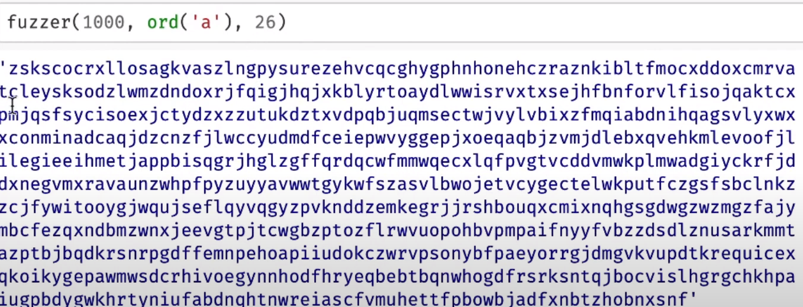
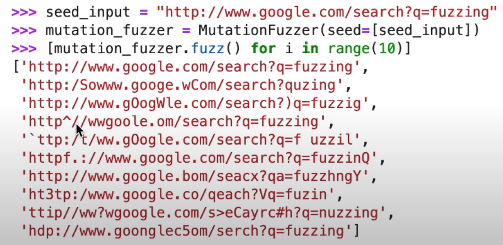

# Fuzzing

(adapted from [The Fuzzing Book by Andreas Zeller et. al.](https://www.fuzzingbook.org/beta/html/Fuzzer.html))

## Generating random software inputs

- 10K to 1M inputs per second
- This was first tried in a Fall 1988 class project in the graduate OS class, taught by Prof. Barton Miller, at the University of Wisconsin.
- Random strings of random lengths
- Search for interesting behaviour
  - Crashes
  - Hangs
  - But probably not logical errors
- Invoke on Microsoft Word --- and it crashed frequently.
```
def fuzzer(max\_length : int = 100, char\_start : int = 32, char\_range: int = 32) -> str;
```



- Pros of random string generation
  - Universally applicable for any piece of software that accepts strings
  - No user inputs required
- Cons of random string generation
  - While this may find lots of bugs initially, soon we stop uncovering new bugs

# A general con of fuzzing
- Fuzzing is only interested crashes and hangs.
- But it is still interesting from the point-of-view of security because once you get a crash, you can inspect the code around it; and perhaps you may identify a buffer overflow or an integer overflow
- Works only for inputs that can be expressed as strings served as inputs at the top-level. Need to write "fuzzing harnesses".
  - the design of the harness may limit the effectiveness of the fuzzing technique
  - the harness may inadvertently cause certain parts of the input space to remain uncovered, e.g., if the program expects a linked list, what happens if the input list contains a cycle.  The harness may not allow the creation of such a harness.

# Mutation-based Fuzzing
- Ask the user to provide a set (possibly singleton) of valid inputs.
- The fuzzer will search for crashes and hangs in the vicinity of these valid inputs
- These valid inputs will be called a "population"
- Randomly pick an input from the population and mutate it. The mutation could be
  - delete a character
  - add a character at a randomly chosen position
  - change an existing character




- These mutation types require no user guidance
- Other user-assisted mutation types are: introduce a word from user-supplied dictionary
  - e.g., HTML tags, C keywords, etc.
- A mutation fuzzer vs. a random input fuzzer
  - the percentage of valid inputs that a mutation fuzzer generates can be much higher
- Coverage-guided Mutation Fuzzing
  - Have a coverage metric
    - code coverage
    - edge coverage
  - Have a method for measuring the coverage metric
    - compiler-based instrumentation
    - binary translation
    - sampling
  - Estimate the coverage of the mutated input
  - If the coverage due to the mutated input has increased, add the mutated input to the population
    - the idea is to move towards increasing the coverage of the tests
    - for instrumentation-based coverage measurement, a single run is often enough to measure the coverage
- American Fuzzy Lop is a fuzzer based on this coverage-guided mutation approach
  - By far the most frequently used fuzzer these days for practical programs
  - Allows you to supply a dictionary
    - the better your dictionary, the better your fuzzer
  - Surprisingly effective at identifying bugs
- Run the fuzzer for hours, days
- This kind of thing is exactly wht penetration testers do today.

- Show a fuzzing effectiveness graph

- Fuzzing with Generators
  - Regular Languages (a^n) -> Context Free Languages (a^nb^n) -> Context Sensitive Languages -> Universal Languages
  - Consider a CFG as follows	
    E -> int | (E + E) | (E * E)
  - Do CFG.fuzz() to generate a random expression from this CFG
  - Attach a generator to the "int" to restrict the values of the leaf nodes to say lie between 10 and 20
    - Produces syntactically-valid inputs
  - Many possibilities for generator-based fuzzing. Generators are turing complete so you can compute anything with them.
  - CFGs are a sweet spot with small doses of turing complete functions (e.g., at leaf nodes) -- so that we retain the declarative nature of CFGs without having long generator functions that may become super-specific to one particular domain (Andreas Zeller).
- Greybox Fuzzing with Grammars
  - Swapping Input Elements
  - Region swapping (a region is a subtree)

# Symbolic Analysis

Find an input that crashes this program.  Construct a first-order logic formula, and use a "SAT/SMT Solver" to solve for its satisfiability.
```
int f(int y) {
  z = y * 2;
  assert(z != 12);
  ...
}
```

Tackle branches using the _Weakest Precondition Calculus_.
```
int f(int y) {
  z = y * 2;
  if (z <= 12) {
    x = w + y;
    assert(x > 4);
  }
  ...
}
```

Avoid exponential-sized first-order logic formulas
```
int f(int y) {
  z = y;
  if (a) {
    z = f1(z);
  } else {
    z = f2(z);
  }
  if (b) {
    z = f3(z);
  } else {
    z = f4(z);
  }
  if (c) {
    z = f5(z);
  } else {
    z = f6(z);
  }
  if (d) {
    z = f7(z);
  } else {
    z = f8(z);
  }
  assert(z != 0);
}
```

Tackle loops!
```
int f(int y, int w) {
  z = y;
  a = w;
  while (a) {
    z = f1(z); //z = z + 1;
    a = f2(a); //a = a - 1;
  }
  assert(z + a != 0);
}
```
Does there exist an input `y`, such that the assertion fails?  This is undecidable in Turing's model of computation with an infinite tape.
