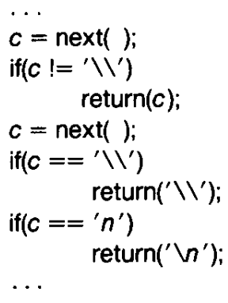
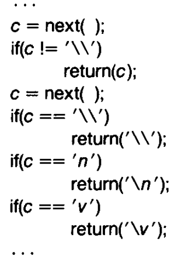
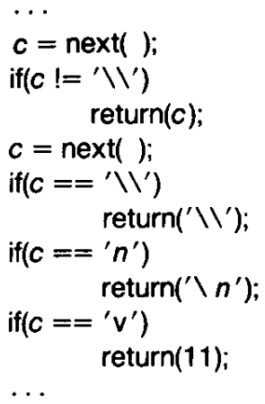
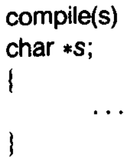
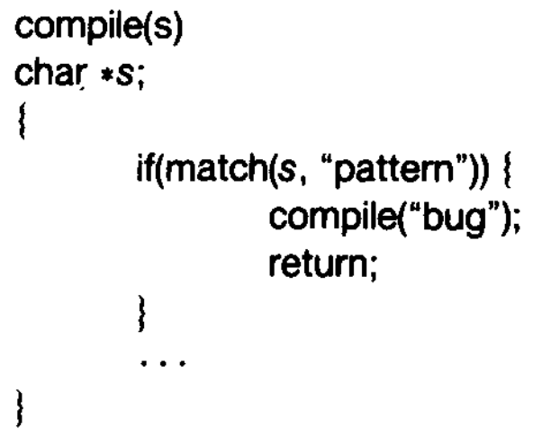
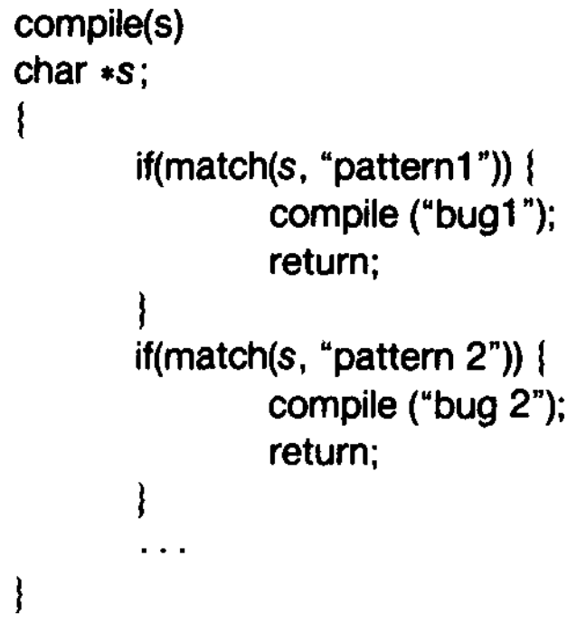

# Side-Channel Attacks

Examples of side-channels: time, power, radio-frequency, heat, cache misses, network messages, ...

## Timing side-channel

The time taken by a proram may leak some information about some secret that is used by the program for some processing.  A timing-difference of say 1-2 microseconds is often enough for the attacker to obtain a reliable signal to be able to deconstruct (a part of) the secret bit-by-bit.

Simple example (also a part of your lab):
```
int check_password(char const* input_password, char const* expected_password)
{
  char const* p = input_password;
  char const* q = expected_password;
  while (*p == *q) {
    //some computation that may take 1-2us
    if (*p == '\0') {
      return 1; //paswwords match
    }
    p++;
    q++;
  }
  return 0; //passwords mismatch
}
```
Invoke this function with different strings for `input_password` and time the program.

Researchers have shown that timing-based attacks can be remotely mounted over the network on the RSA implementations to identify 200 bits of a private key in Apache2/SSL.

## Cache-based side-channel

If we can identify the accessed memory addresses as a function of a secret that is used for processing by a privileged proram, a concurrently running unprivileged program can profile the cache to identify the likely address that may have been accessed, and map it back to the possible bits of the secret key. e.g., content-based caching, memoization, etc.
```
char secret[100];

foo() {
  // read/write a[secret[i]]
}
```

If the attacker is able to co-locate on the same physical machine as the target, then the attacker can do one of the following two things:

### First idea
1. It can warm up all the cache lines with its own data, e.g., by repeately accessing all the addresses until the cache is full.

2. Then invoke the target on a carefully crafted input

3. Then read its own data back and time these reads.  For reads that take longer than others, it is likely that those addresses have been accessed by the target too, which caused cache replacement of the attacker's data for those reads.

4. By carefully analyzing this cache-timing information, it can try and reconstruct the secret (on which the memory accesses may depend).

### Second idea

If the attacker and target can possibly share common pages, e.g., they are running in the same address space (e.g., sharing a common service), then:

1. Instead of warming the cache, first flush the cache

2. Get the target to run

3. Access all the memory regions that _may_ have been accessed by the target, and profile these accesses.  The data that was brought in the cache by the target will be accessed faster.

### Mitigation

Ensure in software that the accessed memory addresses and CPU usage are mostly independent of the secret key.

## Spectre V1

Let's say that that the memory of the target contains public data and secret data stored close to each other.  Also, let's say that the accessed memory addresses depend on some of the public data.
```
char public[10];
char secret[100];

foo() {
  // read/write a[public[i]] in a loop
}
```
But as a prefetching/speculative mechanism, the hardware processor may also read `a[secret[j]]` for small values of `j`.  This can allow the attacker to mount cache-line based side-channel attacks even though the software program was careful to not allow memory accesses to be a function of the secret.

# Quine

A quine is a computer program which takes no input and produces a copy of its own source code as its only output. The standard terms for these programs in the computability theory and computer science literature are "self-replicating programs", "self-reproducing programs", and "self-copying programs".

```
# Example C. Note that %r will quote automatically.
c = 'c = %r; print(c %% c)'; print(c % c)
```


# Reflections on Trusting Trust

[Turing Award Lecture by Ken Thompson](https://www.cs.cmu.edu/~rdriley/487/papers/Thompson_1984_ReflectionsonTrustingTrust.pdf)

"To what extent should one trust a statement that a program is free of Trojan
horses? Perhaps it is more important to trust the people who wrote the
software."

"The C compiler is written in C. What I am about to
describe is one of many "chicken and egg" problems
that arise when compilers are written in their own language."



"Figure (shown above) is an idealization of the code in the C compiler
that interprets the character escape sequence. This is an
amazing piece of code. It _knows_ in a completely portable
way what character code is compiled for a new line in any
character set. The act of knowing then allows it to recompile
itself, thus perpetuating the knowledge."

If in a different character set, the ASCII code of '\n' is different,
then we will get that character set's value (the information
is baked into the compiler that will be used to compile this compiler).

Suppose we wish to add a new character '\v' that represents a vertical
tab as follows. But this will not work at the compiler has not yet _learnt_
the escape-sequence for the vertical tab character.



So we create a temporary _non portable_ implementation as follows



Once the compiler has learned the escape sequence through the non-portable
implementation, we can go back to the portable implementation.

"This is a deep concept. It is as close to a 'learning'
program as I have seen. You simply tell it once, then
you can use this self-referencing definition."

## Now the attack

The following represents a crude version of a compiler that accepts a string (program source code) and returns the executable code.



Now, let's say we use some code like the following in the compiler to plant a trojan horse.  Let's say that the _pattern_ checks to see if we are compiling the `login` program.



However, such a trojan can be easily detected even through a casual browse/review of the compiler's source code.  Now, comes the final idea.



In this, the second pattern matches to check if we are compiling a compiler.  Further the "bug2" that is inserted is a _quine_ that contains both the trojans as the payload.

Once you have compiled this compiler into an executable $C$, you can now remove the trojans from the compiler source code.  If the compiler source code is compiled using $C$, then it will always have the trojan (even if the source code seems correct on a manual review).  Further, this is a perpetuates as the compiler has _learned_ the trojan.

## Moral

Quote from Ken Thompson:
"The moral is obvious. You can't trust code that you did not totally create yourself. (Especially code from companies that employ people like me.) No amount of
source-level verification or scrutiny will protect you from using untrusted code. In demonstrating the possibility of this kind of attack, I picked on the C compiler. I could have picked on any program-handling program such as an assembler, a loader, or even hardware microcode. As the level of program gets lower, these bugs will be harder and harder to detect. A well-installed microcode bug will be almost impossible to detect."

My take:
Use our equivalence checker that is also now available commercially through our startup called CompilerAI Labs ;-).
